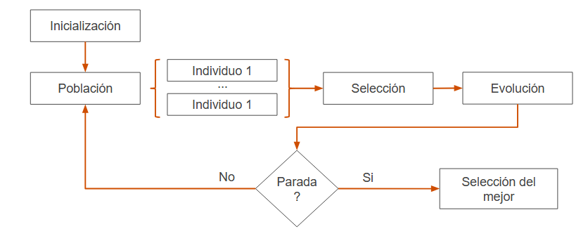
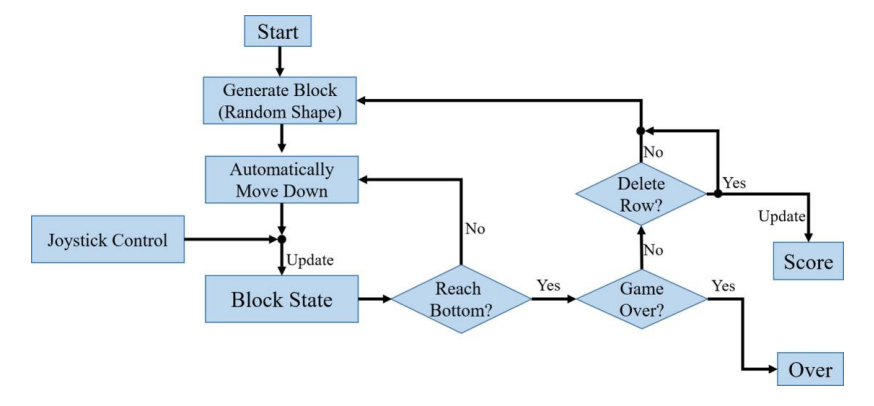

# Algoritmos genéticos 

Los algoritmos genéticos (AG) son una variante de búsqueda local estocástica inspirada en la evolución biológica. A diferencia de otros métodos sistemáticos de búsqueda, los AG operan directamente sobre una población de soluciones, sin necesidad de mantener trayectorias desde un estado inicial. Esto los hace especialmente útiles para problemas de optimización en los que no importa el camino recorrido, sino únicamente el estado final (por ejemplo: diseño de circuitos, layout de fábricas, problemas de scheduling, entre otros).  Por lo tanto podemos definirlos como:
- Algoritmos de búsqueda local
- Técnica de búsqueda local para encontrar soluciones a problemas de optimización

Los algoritmos genéticos representan una gran herramienta de optimización inspirada en los principios de la evolución natural. A través del uso de una población de soluciones, operadores como selección, cruzamiento y mutación, y una función de fitness que guía la evolución, estos algoritmos permiten explorar de manera eficaz espacios de búsqueda complejos, adaptándose a entornos dinámicos y no lineales.

### ¿Cómo funciona? 
- Iterativo
- Parte de una población inicial (estado)
- En cada iteración:
	- Se aplica una función de idoneidad (fitness) sobre los otros individuos, y se les asigna un valor
	- Se seleccionan los más aptos
	-  Se aplican operadores evolutivos sobre los más aptos, seleccionando los nuevos
- Los nuevos son la siguiente iteración
- Se repite hasta cumplir la condición de parada del algoritmo

### Conceptos y analogía con la naturaleza

- Población: modelo del estado del algoritmo genético. Compuesto por individuos (soluciones), en cada iteración se actualiza la población.

- Individuo: posible solución al problema, cada individuo se representa como una instancia   

- Gen: cada uno de los parámetros que definen una solución

- Genotipo: una instancia de la solución, representa a un individuo en particular.

- Fenotipo: "expresión observable" del genotipo (un individuo)

- Operadores evolutivos: Se aplican a los individuos de una población para generar la siguiente Generación. (mejorar las soluciones disponibles)

- Puede involucrar: un único individuo de la población o múltiples individuos

## Función Fitness
  

- Deber devolver los valores más altos para individuos "más aptos"

- Se encarga de representar los requerimientos a los que el algoritmo debe adaptarse

- Permite determinar la calidad de la solución que representa cada individuo

- No solo indica que tan buena es la solución, sino cuan cerca está de la solución óptima.
  

## Selección de padres

- Selección del grupo de individuos que participan del proceso de reproducción

- Se simula el proceso de selección natural

- Hay varias estrategias para el proceso de selección

- Selección proporcional: se realiza de acuerdo a la probabilidad que tiene en cuenta el valor obtenido en la función fitness, se calcula la probabilidad de que un individuo sea seleccionado.

- Selección por torneos: k soluciones al azar y se las compara entre sí. Se elige aquella con mejor valor de fitness, es muy útil cuando la población es muy grande.

## Cruzamiento  

- Se eligen n/2 pares de individuos (n es el total de la población), mediante el proceso de selección descripto. Por cada par se genera aleatoriamente un punto de cruce, se cortan los 2 individuos del par en el punto cruce y se invierten sus partes  

- Mutación

- Una vez aplicado el crossover, se seleccionan cero o más elementos del genoma de cada individuo de acuerdo a una probabilidad p y se los modifica aleatoriamente

- Reemplazo  

- Luego el crossover se siguen estrategias para los individuos recientemente obtenidos.

1. Reemplazo basado en la edad
2. Reemplazo basado en el fitness
3. Reemplazo de los peores individuos
4. Elitismo (mantener los mejores)

## Condiciones de parada
 
- Convergencia: la diferencia de calidad entre una población y la anterior es menor que un determinado umbral. La calidad puede medirse de distintas maneras, típicamente con valores de fitness.

- Tiempo: Se para el algoritmo al cabo de un cierto tiempo

- Cantidad de Iteraciones: Se para luego de un cierto número de iteraciones

  

- Condiciones especiales e hibridas: por ej. Si hay restricciones duras, aunque cumpla el criterio de parada, puede continuar con el algoritmo hasta que se haya satisfecho estas restricciones. También pueden combinarse criterios anteriores.

## Teoría de esquemas (schema theory)

Se introduce el concepto de esquema (schema) como una subestructura dentro del genotipo que puede representar características útiles. Por ejemplo, en un problema como las 8 reinas, un esquema podría ser "las tres primeras reinas en columnas donde no se atacan". Si los individuos que contienen ese esquema tienen mejor fitness, el número de ellos aumentará generación tras generación.

  

## Comparaciones y rendimiento

  

Si bien los AG no siempre superan a otros métodos como el hill climbing estocástico, su principal ventaja radica en: 

- La búsqueda paralela sobre múltiples regiones del espacio de soluciones.

- Su capacidad de recombinar bloques útiles gracias al crossover.

- La posibilidad de escapar de óptimos locales mediante mutación.

No obstante, su rendimiento puede variar dependiendo de cómo se represente la solución, cómo se defina la función de fitness, y qué estrategias de selección/crossover se usen. Se requiere una ingeniería cuidadosa para que funcionen bien en la práctica.

## Ventajas
- Menos memoria
- Usos de esquemas en las soluciones
- Al trabajar con múltiples soluciones simultáneamente, GA puede explorar distintas regiones del espacio, reduciendo el riesgo de caer en óptimos locales.
- La variabilidad entre individuos permite una búsqueda más robusta. El cruce y la mutación aseguran que se mantenga esa diversidad a lo largo de las generaciones.
- Solo necesitan una función de evaluación que diga qué tan buena es una solución.
- Pueden adaptarse a una amplia variedad de problemas (discretos, continuos, combinatorios) mediante diferentes representaciones y operadores.

## Desventajas
- Requiere muchos hiperparámetros: tamaño de población, tasas de cruce y mutación, métodos de selección, etc.
- Evaluar muchas soluciones por generación y realizar operaciones genéticas implica un costo mayor que algoritmos más simples como Hill Climbing.
- Una mala codificación de las soluciones puede hacer que los operadores genéticos generen soluciones inválidas o ineficientes.

## Limitaciones y desafíos

- El rendimiento depende mucho de una buena calibración. Si no se ajustan bien los parámetros, el algoritmo puede fallar o ser ineficiente.

- Si la población pierde diversidad muy rápido, todos los individuos se vuelven similares y el algoritmo se "estanca" sin llegar a una buena solución global.

- No siempre son la mejor opción para problemas donde hay restricciones de tiempo (como decisiones en tiempo real).

- Si la función de evaluación no está bien diseñada, el algoritmo puede dirigir la búsqueda hacia soluciones poco útiles o sesgadas. Esto es especialmente relevante en problemas con múltiples objetivos o restricciones complejas.  

  

## Consideraciones para el entorno del juego Tetris

El objetivo principal es optimizar la manera de jugar a través de la mejor colocación posible de las piezas, maximizando la puntuación, las líneas eliminadas y la duración del juego antes de perder.

Los algoritmos genéticos se utilizan aquí para evolucionar funciones de evaluación que guíen las decisiones del agente. Cada individuo en la población representa un conjunto de parámetros (pesos) que determinan la calidad de una posible posición para cada pieza, considerando características como:
- Altura máxima del tablero
- Número de huecos generados
- Cantidad de líneas eliminadas
- Espacios inaccesibles

El fitness de cada individuo se mide al simular partidas con esa configuración y registrar el puntaje, líneas eliminadas y duración del juego. A través de operadores de selección, cruzamiento y mutación, se generan nuevas configuraciones que progresivamente pueden mejorar el desempeño del agente.

## Bibliografía
Talbi, E.-G. (2009). _Metaheuristics: From design to implementation_. Wiley.

Russell, S., & Norvig, P. (2010). _Artificial intelligence: A modern approach_ (3rd ed.). Prentice Hall.
