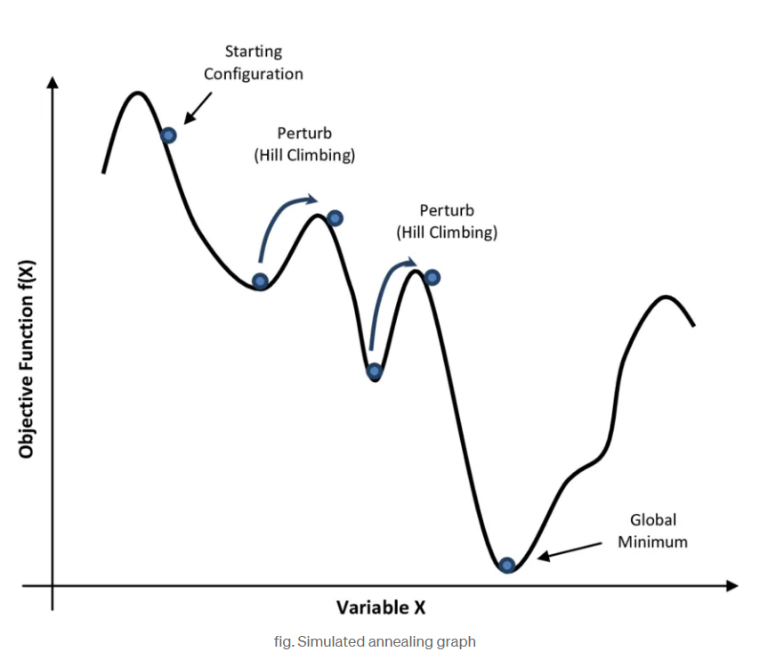

# Simulated Annealing

Es un algoritmo de optimización diseñado para buscar una solución óptima o casi óptima en un amplio espacio de soluciones. Su nombre y concepto derivan del proceso de recocido en metalurgia, donde un material se calienta y luego se enfría lentamente para eliminar defectos y lograr una estructura cristalina estable. En el recocido simulado, el "calor" corresponde al grado de aleatoriedad en el proceso de búsqueda, que disminuye con el tiempo (programa de enfriamiento) para refinar la solución. El método se utiliza ampliamente en optimización combinatoria, donde los problemas suelen presentar numerosos óptimos locales en los que las técnicas estándar, como el descenso de gradiente, podrían atascarse. El recocido simulado destaca por eludir estos mínimos locales al introducir aleatoriedad controlada en su búsqueda, lo que permite una exploración más exhaustiva del espacio de soluciones evitando quedar atrapado en óptimos locales, como suele ocurrir con Hill Climbing.

## Analogía intuitiva  

Imaginemos una superficie irregular con muchas depresiones (mínimos locales) y una bola que queremos llevar al punto más bajo. Si simplemente la dejamos rodar (como en hill climbing), se detendrá en una depresión local. Si, en cambio**,** sacudimos la superficie (como lo hace simulated annealing con alta temperatura), la bola puede salir de esa depresión y caer eventualmente en el mínimo global. A medida que reducimos las sacudidas (temperatura), la bola se estabiliza en la mejor posición posible.

## ¿Por qué es necesario?

- Hill climbing puro siempre se mueve hacia estados con mayor valor (o menor costo) y, por lo tanto, puede estancarse en óptimos locales**.**

- Un random walk (caminar aleatoriamente entre estados) es completo, pero extremadamente ineficiente.

  - Simulated Annealing combina lo mejor de ambos mundos**:** la eficiencia de hill climbing con la capacidad de escapar de mínimos locales del random walk.

## ¿Cómo funciona?  

- Parte de un estado inicial y elige un sucesor aleatorio en cada iteración.

- Si el nuevo estado es mejor que el actual, siempre se acepta.

- Si el nuevo estado es peor, puede aceptarse con una cierta probabilidad p, la cual depende de:
	- ΔE: qué tan peor es el nuevo estado.
	- T: la temperatura actual del sistema.

- La probabilidad de aceptar un mal movimiento disminuye exponencialmente a medida que el valor de ΔE aumenta y T disminuye.

- Después de cada iteración, la temperatura disminuye según un programa de enfriamiento predefinido, que determina la rapidez con la que converge el algoritmo. Esto significa que al principio el algoritmo acepta más \"errores\", pero se va volviendo más estricto con el tiempo.
- Si el enfriamiento se realiza lentamente, la probabilidad de encontrar el óptimo global se aproxima a 1.
- El algoritmo continúa hasta que el sistema alcanza una temperatura baja (es decir, no se encuentran más mejoras significativas) o se alcanza un número predeterminado de iteraciones.

## Programa de enfriamiento

El programa de enfriamiento desempeña un papel crucial en el rendimiento del recocido simulado. Si la temperatura disminuye demasiado rápido, el algoritmo podría converger prematuramente a una solución subóptima (óptimo local). Por otro lado, si el enfriamiento es demasiado lento, el algoritmo puede tardar demasiado en encontrar la solución óptima. Por lo tanto, es esencial encontrar el equilibrio adecuado entre la exploración (alta temperatura) y la explotación (baja temperatura).

En cambio, un enfriamiento más lento permite al algoritmo seguir explorando durante más tiempo, aceptando cambios más arriesgados y con más probabilidad de salir de esos óptimos locales. Esto le da más flexibilidad para encontrar mejores soluciones, aunque puede requerir más tiempo de ejecución.

Para controlar esta transición, se utilizan diferentes esquemas de enfriamiento, que definen cómo va bajando la temperatura en el tiempo:

#### 1. Enfriamiento lineal
-   La temperatura se reduce en pasos constantes.
-   Es fácil de implementar y predecible.
-   Es útil cuando se quiere tener un descenso más **estable y controlado**.

#### 2. Enfriamiento exponencial

-   La temperatura disminuye de manera rápida al principio y más lentamente después.
-   Favorece una exploración inicial amplia, seguida de una etapa más enfocada en la mejora.
-   Muy usado en la práctica por su eficiencia y simplicidad.

#### 3. Enfriamiento logarítmico

-   Baja la temperatura muy lentamente.
-   Permite una exploración más profunda y prolongada, pero puede ser más costoso en tiempo.
 -   Está más orientado a obtener soluciones cercanas al óptimo en problemas muy complejos.

## Condiciones de Parada

Las condiciones de parada permiten definir cuánto tiempo, esfuerzo o intentos se invertirán en la búsqueda de una solución. Elegir una buena condición de parada es esencial para lograr un equilibrio entre calidad de la solución y eficiencia del algoritmo.

### Una buena condición de parada permite:
-   Evitar que el algoritmo pierda tiempo innecesario cuando ya no está mejorando.
-   Asegurar que el algoritmo termine en un tiempo razonable, especialmente en aplicaciones como videojuegos donde las decisiones deben tomarse rápido.
-   Tener un control claro del rendimiento y comportamiento del algoritmo en distintos contextos.

Las condiciones más comunes que se utilizan (solas o combinadas) para decidir cuándo detener el algoritmo de Simulated Annealing son:

#### 1. Temperatura mínima alcanzada

-   El algoritmo se detiene cuando la temperatura baja por debajo de un cierto umbral.
-   Tiene sentido porque, a temperaturas muy bajas, SA ya no acepta soluciones peores, y se comporta como un algoritmo más determinista.
    

#### 2. Número máximo de iteraciones o pasos

-   Se fija un número máximo de repeticiones (por ejemplo, 1000 movimientos).
-   Es útil para garantizar que el algoritmo termine siempre en un tiempo controlado.
-   Muy utilizado en juegos o sistemas en tiempo real.
    

#### 3. Tiempo límite de ejecución

-   Se asigna una cantidad de tiempo (en milisegundos o segundos) como máximo para que el algoritmo funcione.
-   Muy útil cuando el algoritmo debe integrarse en sistemas interactivos, como videojuegos.
    

#### 4. Número de iteraciones sin mejora

-   El algoritmo se detiene si después de cierta cantidad de pasos no se logra ninguna mejora en la solución.
-   Esto indica que probablemente se alcanzó un valle o punto muerto.
    

#### 5. Combinación de las anteriores

-   Por ejemplo: “detenerse si pasaron 1000 iteraciones o si la temperatura llegó a menos de 0.01”.
-   Esto da mayor flexibilidad y control.

## Limitaciones

-   ****Sensibilidad de los parámetros:**** el rendimiento del recocido simulado depende en gran medida de la elección de los parámetros, en particular la temperatura inicial y el programa de enfriamiento.

-   ****Tiempo de cálculo:**** dado que el recocido simulado requiere muchas iteraciones, puede resultar computacionalmente costoso, especialmente para problemas grandes.

-   ****Convergencia lenta:**** la tasa de convergencia es generalmente más lenta que la de métodos más deterministas como la optimización basada en gradientes.

## Consideraciones para el entorno del juego tetris  

El agente puede usar Simulated Annealing para:
- Buscar la mejor posición y rotación de la pieza actual y tal vez la siguiente, en función de una heurística (por ejemplo: cantidad de líneas eliminadas, altura máxima, huecos generados, etc.).

- Si el espacio de búsqueda es muy grande (por ejemplo, mirar varias jugadas hacia adelante), entonces usar búsqueda local con simulated annealing puede ayudar a:
	- Escapar de malas decisiones locales.
	- Explorar posibilidades que, a primera vista, parecen malas pero llevan a mejores resultados a futuro.

## Bibliografía

Talbi, E.-G. (2009). _Metaheuristics: From design to implementation_. Wiley.

Russell, S., & Norvig, P. (2010). _Artificial intelligence: A modern approach_ (3rd ed.). Prentice Hall.

https://www.geeksforgeeks.org/artificial-intelligence/what-is-simulated-annealing/
