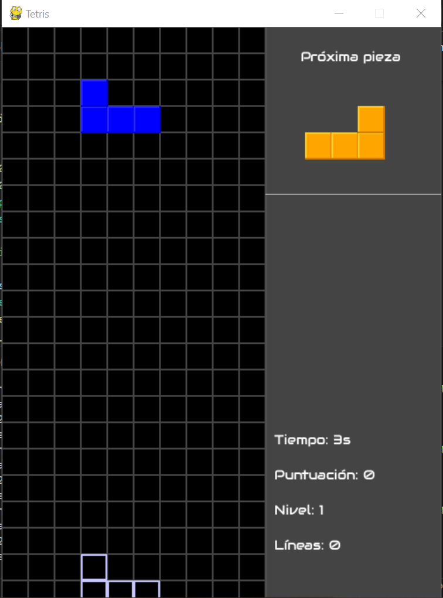

**Tetris en Python**
  

Se implementó el juego "Tetris Clásico" en Python. El código se
encuentra estructurado en varias clases organizadas en módulos para
representar las distintas funcionalidades del juego, es decir, el
tablero, las piezas, la lógica y la interfaz.
  

Se implementó la versión básica de Tetris con:

- 7 tipos de piezas: I,O,T,S,Z,J,L

- Rotación de piezas

- Eliminación de líneas completas

- Detección de colisiones

- Game Over

- Pieza fantasma

- Cola con las próximas piezas

- Acumulación de puntos por líneas eliminadas
  
  
**Estructura**
  

- main.py: Punto de entrada

- tetris.py: Lógica general del juego

- tablero.py: Representación y manipulación del tablero

- tetronimo.py: Clase destinada a las piezas del juego

- piezas.py: Diccionario con las formas y colores de las piezas

- interfaz.py: Para mostrar por consola
  
  
**Clases Principales**
  

- Tetronimo: Representa una pieza del juego

  - Atributos: pieza, x, y, rotación, formas
  - Metodos clave: 

      - obtenerFormaActual(): devuelve la forma según su rotación
    
      - rotar() y rotacionInversa(): cambia la orientación de la pieza
    
      - copy(): Crea una copia exacta, es muy útil para verificar los
        movimientos antes de aplicarlos
    
      - imprimir_pieza(): imprime la forma actual de la pieza
    
      - Piezas utilizadas: O (amarillo), I (celeste), T (purpura), L
    (naranja), J (azul), S (verde), Z (rojo).

     
    

- Pieza: Define los diccionarios

  - PIEZAS: formas y rotaciones de cada una de ellas

  - COLORES: Colores asignados a cada una
    

- Tablero: Contiene y gestiona el estado del juego

  - Tamaño fijo de 20 filas x 10 columnas
  - Metodos clave:

      - generar_matriz(): Se genera la matriz con esas dimensiones
    
      - eliminar_lineas(): función que cuando se completa una línea la
        elimina del tablero
    
      - hay_colision(): Se verifica si hay colision entre las piezas del
        juego
    
      - fijar_pieza(): Una ve verificado que se puede, coloca la pieza donde
        elige el usuario

  - Tablero al inicio del juego:

    

  - Tablero luego de varias jugadas:

    

- Tetris: Clase con el control principal
  
  - Metodos clave:  

      - actualizar_estado(): Actualiza el nivel en el juego, la puntuación y
        las líneas eliminadas
    
      - mover_si_valido() y rotar_si_valido(): Verifica que los movimientos
        que se quieran hacer con la pieza dentro del juego se puedan hacer
    
      - Velocidad ajustable segun nivel y tipo de caida:
          -   Normal
          -   Soft drop
          -   Hard drop
    
      - actualizar_puntos(): método mediante el cual se actualizan los puntos
      del jugador
          - 1 linea: 100 puntos
          - 2 lineas: 200 puntos
          - 3 lineas: 400 puntos
          - 4 lineas o  mas: 800 puntos
    
      - game_over(): Al tocar el "techo" se corta el juego, y pierde
    
  - Calculo velocidad de la caída:

    

<!-- -->

- Interfaz: Clase encargada de mostrar el estado del juego utilizando la
  biblioteca pygame

  - Dibuja:
      - Tablero
      - Pieza actual
      - Pieza fantasma
      - Proxima pieza
        

  - Un panel lateral con:
      - Puntaje
      - Nivel
      - Tiempo
      - Lineas eliminadas 
