# **Algoritmos de Búsqueda local para jugar "Tetris"**

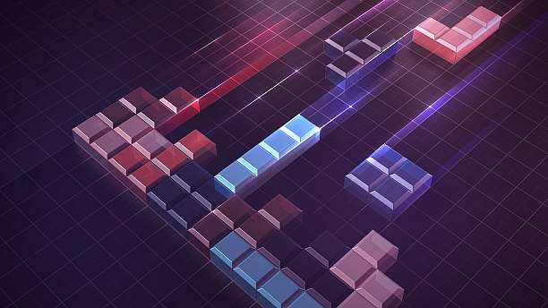

Integrantes:

- Valerio, Perla

- Perea, Trinidad

___

## 1. **Introducción**

El presente proyecto tiene como finalidad aplicar y poner en práctica
los conceptos de algoritmos de búsqueda local estudiados en la materia,
mediante el desarrollo de un agente capaz de jugar de forma autónoma al
videojuego Tetris. Este juego, creado por Alekséi Pázhitnov en 1984, se
caracteriza por un tablero rectangular en el que piezas de diferentes
formas "tetrominos" descienden de manera continua, y el objetivo del
jugador es encajarlas de forma tal que se completen líneas horizontales,
las cuales se eliminan para obtener puntuación y evitar que el tablero
se llene.

El poroyecto consistió en implementar desde cero una versión funcional
de Tetris en el lenguaje de programación Python, que sirviera como
entorno de pruebas para el agente. Sobre esta base, se incorporaron tres
algoritmos de búsqueda local: **Hill Climbing**, **Simulated Annealing**
y **Algoritmo Genético**, adaptados para la toma de decisiones en cada
jugada. El agente evalúa posibles movimientos y selecciona la opción que
maximiza su función de evaluación, considerando factores como líneas
eliminadas, altura de la pila de piezas y huecos generados.

La elección de Tetris como caso de estudio se debe a que combina
elementos de aleatoriedad, planificación y optimización en tiempo real,
lo que lo convierte en un entorno ideal para experimentar con
estrategias de búsqueda local. Este informe presenta el proceso de
desarrollo, la metodología empleada, los resultados obtenidos y un
análisis comparativo del rendimiento de cada algoritmo.

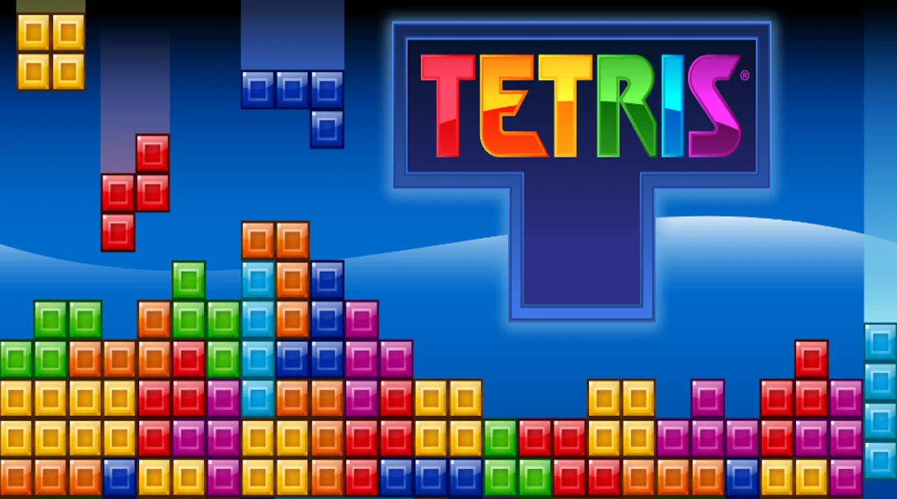

___

## 2. **Marco Teórico**

El presente proyecto se enmarca en el estudio de técnicas de **búsqueda local** y **metaheurísticas** aplicadas a la toma de decisiones en el juego Tetris. A continuación, se describen los fundamentos teóricos relevantes para la implementación de los agentes, con especial énfasis en los principios, ventajas y limitaciones de los algoritmos seleccionados: Hill Climbing, Simulated Annealing y Algoritmo Genético.

---

### 2.1 **Descripción del juego**

Tetris es un videojuego de tipo puzzle en el que piezas compuestas por
bloques cuadrados denominadas tetrominos descienden desde la parte
superior de un tablero rectangular. El objetivo es mover y rotar estas
piezas para encajarlas de forma que se completen líneas horizontales
continuas. Cada vez que se completa una línea, esta se elimina y se
otorgan puntos al jugador.

El juego finaliza cuando las piezas apiladas alcanzan la parte superior
del tablero, impidiendo la aparición de nuevas piezas. Durante la
partida, las piezas se generan de manera aleatoria y descienden de forma
continua, aumentando la velocidad a medida que avanza el juego y va
subiendo de nivel, lo que va aumentando su dificultad.

Existen siete tipos de tetrominós, cada uno con una forma característica
identificada por una letra: I, O, T, L, J, S y Z. El jugador puede
desplazar las piezas hacia la izquierda o derecha, rotarlas y hacerlas
descender más rápidamente, con el fin de colocarlas en la posición
óptima para maximizar la puntuación y evitar huecos innecesarios en la
estructura de bloques.

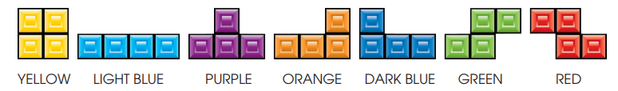

En esta implementación, se adoptó un sistema de puntuación clásico que
otorga diferentes cantidades de puntos según el número de líneas
eliminadas de forma simultánea: una línea (singles), dos (doubles), tres
(triples) o cuatro (tetrises).

---

### 2.2 **Objetivos del Juego**

El objetivo principal del Tetris, tanto en la versión tradicional, como
en la implementada en este proyecto, es maximizar la puntuación e ir
avanzando de nivel, evitando que el tablero se llene.

Por lo tanto el agente debe colocar las piezas de forma estratégica, con
el fin de completar líneas horizontales que se eliminan de manera
automática.

El objetivo se desenglosa con el siguiente puntaje:

- Singles: 1 líneas eliminada tiene el valor de 100 puntos

- Doubles: 2 líneas eliminadas de manera simultánea tiene el valor de
  200 puntos

- Triples: 3 líneas eliminadas de manera simultánea tiene el valor de
  400 puntos

- Tetrises: 4 líneas eliminadas de manera simultánea tiene el valor de
  800 puntos

Por lo tanto, se busca priorizar la mayor cantidad de líneas juntas para
eliminar de manera simultánea, y así sumar la mayor cantidad de puntos.
A su vez mantener un tablero estable, es decir evitar dejar huecos o
espacios difíciles de rellenar, también minimizar la altura alcanzada
para reducir el riesgo de perder.

A medida que se va avanzando en el juego, es decir, se va subiendo de
nivel, el tiempo de caída de las piezas va aumentando, lo que va
dificultando a la hora de tomar decisiones.

---

### 2.3 Búsqueda Local

Los algoritmos de búsqueda local exploran el espacio de soluciones moviéndose de un estado a otro a partir de pequeñas modificaciones (vecinos). Su objetivo es mejorar progresivamente una función de evaluación.

Sus características principales son:

- No requieren explorar todo el espacio de estados.  
- Funcionan bien en dominios grandes o continuos.  
- Pueden estancarse en óptimos locales.

Debido a que Tetris requiere tomar decisiones rápidas y con información incompleta, la búsqueda local es un enfoque adecuado y ampliamente utilizado en la literatura.

---

### 2.4 Hill Climbing

Hill Climbing es un algoritmo de búsqueda local que avanza de manera iterativa hacia estados que presentan una mejora respecto del estado actual, de acuerdo con una función de evaluación previamente definida. Su principio fundamental consiste en seleccionar, dentro del conjunto de estados vecinos, aquel que maximiza (o minimiza) la heurística utilizada. Es un método determinista, de bajo costo computacional y ampliamente aplicado en problemas donde es necesario tomar decisiones rápidas.

En el contexto del juego Tetris, los vecinos pueden interpretarse como las distintas colocaciones posibles de la pieza actual (combinaciones de posiciones y rotaciones válidas). El algoritmo evalúa cada una de estas configuraciones mediante una heurística que estima la calidad del tablero resultante y elige la mejor alternativa disponible.

Si bien Hill Climbing es eficiente y fácil de implementar, presenta limitaciones importantes. Debido a que solo acepta movimientos que mejoran el estado presente, puede quedar atrapado en **óptimos locales**, mesetas o crestas del paisaje heurístico. En Tetris, esto implica que decisiones localmente convenientes —como reducir la altura inmediata del tablero o evitar un hueco puntual— pueden conducir a configuraciones desfavorables a futuro. Esto sucede especialmente en un entorno dinámico y altamente no lineal como el del Tetris, donde una buena jugada “local” no necesariamente implica un buen desempeño a largo plazo.

A pesar de estas limitaciones, Hill Climbing resulta adecuado como base comparativa, dado que ofrece una línea de referencia eficiente contra la cual evaluar métodos de búsqueda más complejos.

---

### 2.5 Simulated Annealing (SA)

Simulated Annealing (SA) es un algoritmo de búsqueda local estocástico inspirado en el proceso físico de recocido de metales, donde un material se calienta y luego se enfría de manera gradual hasta alcanzar un estado estable de mínima energía. En su adaptación al ámbito computacional, el algoritmo permite aceptar movimientos que empeoran la función de evaluación con una probabilidad controlada por un parámetro denominado temperatura. Este mecanismo introduce exploración en la búsqueda y evita que el proceso quede atrapado en óptimos locales.

El funcionamiento básico del algoritmo consiste en partir de un estado inicial y generar, en cada iteración, un estado vecino. Si el vecino mejora la función de evaluación, se acepta de manera determinista. Si es peor, se acepta con una probabilidad que decrece a medida que disminuye la temperatura, usualmente modelada por la expresión:

P(aceptar)=e
T
Δ
	​

donde:

Δ es la diferencia entre la evaluación del nuevo estado y el actual, y 
𝑇 es la temperatura vigente. 

Conforme el algoritmo avanza, la temperatura se reduce siguiendo un esquema de enfriamiento, lo que provoca una transición gradual desde un comportamiento altamente exploratorio hacia uno predominantemente explotador.

En el contexto del juego Tetris, los vecinos pueden interpretarse como las distintas jugadas posibles para la pieza actual, es decir, las combinaciones de rotaciones y posiciones válidas que pueden producirse al colocarla en el tablero. Simulated Annealing evalúa cada una de estas configuraciones según una heurística definida y decide si debe adoptarlas o no considerando tanto su calidad objetiva como la temperatura del sistema.

La principal ventaja de SA respecto de métodos puramente deterministas, como Hill Climbing, es su capacidad de evitar quedar atrapado en óptimos locales. Al permitir la aceptación probabilística de jugadas desfavorables en las primeras etapas, el algoritmo puede escapar de configuraciones aparentemente buenas pero que conducen a situaciones negativas a largo plazo. Esto resulta especialmente relevante en Tetris, donde la estructura del tablero puede presentar múltiples “trampas heurísticas”: huecos inevitables, columnas muy altas o configuraciones que dificultan la futura colocación de piezas.

No obstante, Simulated Annealing requiere un diseño adecuado de sus parámetros —como la temperatura inicial y la tasa de enfriamiento— para lograr un equilibrio entre exploración y explotación. A pesar de esta sensibilidad, constituye una técnica robusta para entornos dinámicos como Tetris, donde la incertidumbre y la necesidad de adaptación continua hacen valiosa la capacidad de evaluar movimientos subóptimos de manera controlada.

---

### 2.6 Algoritmos Genéticos (GA)

Los Algoritmos Genéticos son métodos de optimización inspirados en los principios de la evolución biológica, particularmente en la selección natural, recombinación y mutación. Su objetivo es evolucionar una población de soluciones candidatas hacia configuraciones cada vez más aptas según una función de evaluación. A diferencia de los algoritmos puramente locales, como Hill Climbing o Simulated Annealing, los GA operan sobre un conjunto de soluciones simultáneamente, lo que mejora la exploración del espacio de búsqueda y reduce la probabilidad de quedar atrapados en óptimos locales.

En el contexto de Tetris, cada individuo de la población puede representarse como una posible colocación de la pieza actual (posición y rotación) o, en variantes más amplias, como secuencias de jugadas futuras. La función de fitness evalúa cada individuo estimando la calidad del tablero resultante mediante una heurística que considera factores como:

- líneas eliminadas,
- alturas máximas,
- huecos generados,
- uniformidad de la superficie.

A partir de esta población inicial, el GA aplica operadores evolutivos:

- **Selección:** elige las configuraciones más prometedoras, favoreciendo aquellas con mayor fitness.
- **Crossover:** combina dos individuos para generar nuevos candidatos que heredan características de ambos, lo cual promueve la exploración estructurada del espacio.
- **Mutación:** introduce cambios aleatorios en un individuo, aportando diversidad genética y evitando la convergencia prematura.

La naturaleza poblacional de los Algoritmos Genéticos ofrece ventajas significativas para un juego como Tetris, donde la estructura del espacio heurístico es altamente irregular y el impacto de cada jugada puede variar según futuros estados del tablero. Al explorar múltiples alternativas en paralelo y mantener diversidad durante el proceso evolutivo, estos algoritmos son capaces de detectar jugadas que heurísticas puramente locales pasarían por alto.

Si bien los GA suelen requerir un mayor costo computacional y un ajuste cuidadoso de parámetros (tamaño de población, probabilidad de cruce y mutación, método de selección), proporcionan una capacidad de búsqueda más global y flexible. Por ello, constituyen un enfoque adecuado para evaluar estrategias en un entorno dinámico e impredecible como Tetris, y permiten contrastar su desempeño frente a los métodos locales tradicionales.

___ 

## **Cuadro Comparativo entre algoritmos de búsqueda local aplicados**

| Parámetro                | Hill Climbing                                                                 | Simulated Annealing                                                                 | Algoritmo Genético                                                                 |
|---------------------------|-------------------------------------------------------------------------------|-------------------------------------------------------------------------------------|------------------------------------------------------------------------------------|
| **Tipo de búsqueda**      | Búsqueda local determinística: siempre elige la mejor opción inmediata        | Búsqueda local probabilística: permite aceptar soluciones peores al inicio, simulando el enfriamiento de metales | Búsqueda poblacional inspirada en la evolución biológica: trabaja con una población de soluciones que evolucionan |
| **Capacidad de escapar de óptimos locales** | Baja: se queda atrapado si no hay vecinos mejores                          | Alta: puede aceptar soluciones peores para escapar de óptimos locales               | Alta: la diversidad genética permite explorar múltiples regiones del espacio de búsqueda |
| **Exploración vs explotación** | Explotación fuerte: enfocado solo en mejorar                               | Equilibrio controlado por la temperatura: más exploración al principio, más explotación al final | Alta exploración: combina cruce y mutación para generar variedad                    |
| **Uso de aleatoriedad**   | Mínimo: solo si se elige aleatoriamente entre vecinos iguales                 | Moderado: usa aleatoriedad para seleccionar vecinos y aceptar soluciones peores     | Alto: selección, cruce y mutación son procesos estocásticos                         |
| **Dependencia de parámetros** | Baja: solo depende de la función heurística                                | Media: necesita definir temperatura inicial, tasa de enfriamiento y criterio de parada | Alta: muchos parámetros influyen (tamaño de población, tasas de mutación/cruce, elitismo, etc.) |
| **Costo computacional**   | Bajo: rápido, simple, apto para decisiones en tiempo real                     | Medio: más costoso por evaluar múltiples vecinos y usar funciones probabilísticas   | Alto: evalúa múltiples soluciones por generación y realiza operaciones genéticas     |
| **Aplicabilidad en tiempo real** | Alta: ideal para entornos con decisiones rápidas como Tetris             | Media: puede adaptarse, pero necesita buen ajuste de parámetros para ser ágil       | Baja-Media: requiere optimización o simplificación para usarse en tiempo real       |
| **Complejidad de implementación** | Baja: se implementa fácilmente con pocos pasos                          | Media: requiere lógica de temperatura, aceptación probabilística y enfriamiento     | Alta: implica manejar estructuras de población, operadores genéticos y ciclos evolutivos |

___

## 3. **Diseño Experimental**

En esta sección se describen los aspectos técnicos y las decisiones de implementación adoptadas para el desarrollo de los tres agentes inteligentes (Hill Climbing, Simulated Annealing y Algoritmo Genético) aplicados al entorno del juego Tetris. Además, se detallan las representaciones internas utilizadas, la función de evaluación, los parámetros configurados y las métricas analizadas durante los experimentos.

---

### 3.1 Control experimental
Para llevar a cabo el análisis comparativo de los tres algoritmos implementados, se utilizó una semilla aleatoria que garantiza la generación de la misma secuencia de piezas para los tres algoritmos. Esta decisión se tomó debido a que, en pruebas preliminares sin control de secuencia, los resultados obtenidos eran inconsistentes, lo que impedía extraer conclusiones válidas. Al utilizar la semilla, se asegura que cada algoritmo reciba las mismas piezas en el mismo orden, permitiendo una comparación justa y precisa de su desempeño.

Para garantizar la reproducibilidad y la comparabilidad entre algoritmos, se utilizaron 15 semillas aleatorias. Cada semilla se usó para realizar una ejecución de cada uno de los tres algoritmos (Hill Climbing, Simulated Annealing y Algoritmo Genético). Es decir, para cada valor de semilla, los tres algoritmos enfrentaron exactamente la misma secuencia de piezas.

En cada ejecución se generaron 400 piezas, lo que permite observar el desempeño de los agentes en partidas suficientemente largas como para que se manifieste su comportamiento estratégico.

La generación de piezas se realizó a través de un sistema de 7-bag, que es el mecanismo estándar en Tetris moderno. En este sistema, las siete piezas posibles se agrupan en una “bolsa” y se ordenan de forma aleatoria. Cuando una bolsa se vacía, se crea una nueva y se la vuelve a mezclar. Para asegurar que la secuencia generada fuera idéntica para los tres algoritmos dentro de la misma iteración, se empleó: random.seed(semilla)

Cada vez que se inicia una nueva bolsa, la mezcla se ve determinada por la semilla global de la ejecución. Esto permite que:

1. Cada iteración del experimento produzca una secuencia única, pero reproducible.

2. Los tres algoritmos compitan bajo exactamente las mismas condiciones, eliminando la variabilidad externa debida al azar.

Para evaluar el rendimiento y las decisiones de los algoritmos, se seleccionaron las siguientes métricas:

* Cantidad de singles, dobles, triples y tetrises: Permite analizar la eficiencia en la eliminación de líneas y la capacidad de formar combinaciones óptimas.

* Nivel alcanzado por algoritmo: Indica la progresión del juego y la habilidad del algoritmo para sostenerse en niveles más avanzados.

* Puntaje obtenido: Refleja el desempeño global del algoritmo en función de las reglas de puntuación del juego.

* Tiempo promedio de toma de decisión: Evalúa la eficiencia computacional y la rapidez con la que el algoritmo selecciona la mejor acción posible.

* Consistencia por algoritmo: Mide la estabilidad del rendimiento entre distintas ejecuciones del mismo algoritmo bajo la misma secuencia de piezas.

* Cantidad de líneas eliminadas por piezas colocadas: Proporciona un indicador de eficiencia en la colocación de piezas y en la optimización del espacio de juego.

Estas métricas permiten un análisis integral, considerando tanto el desempeño cuantitativo (puntaje, líneas eliminadas) como cualitativo (eficiencia de decisiones y consistencia), proporcionando una visión completa sobre las fortalezas y debilidades de cada algoritmo.

---

### 3.2 Simulacion del entorno, tiempo y procesamiento de piezas

En el simulador utilizado, el tiempo no constituye una restricción operativa relevante para los agentes. Aunque en el Tetris original el descenso de las piezas se acelera a medida que aumentan los niveles, en nuestra implementación las decisiones se toman de manera instantánea, dado que los algoritmos de búsqueda empleados (Hill Climbing, Simulated Annealing y Algoritmo Genético) responden en tiempos muy reducidos. Como resultado, los cambios de velocidad del juego no afectan la capacidad de exploración ni la calidad de las decisiones.

El proceso de decisión se estructura de forma secuencial: cada vez que aparece una pieza nueva, el algoritmo correspondiente se ejecuta nuevamente para evaluar todas las posiciones y rotaciones válidas. Una vez seleccionada la mejor acción para la pieza actual, el movimiento se aplica al tablero y se genera la siguiente pieza. De esta manera, los algoritmos se ejecutan una vez por cada pieza a colocar, simulando el avance natural del juego.

---

### 3.3 Representación del entorno

El entorno de Tetris fue modelado como una matriz de 22 filas por 10 columnas, donde las 2 primeras filas se utilizan para posicionar las piezas cuando aparecen por primera vez en el tablero por encima de la línea skyline, donde cada celda puede encontrarse ocupada o libre. Las piezas corresponden a los siete tetrominós estándar (I, O, T, L, J, S, Z), cada uno implementado con todas sus rotaciones válidas y con su color característico, siguiendo la convención del Tetris clásico.

    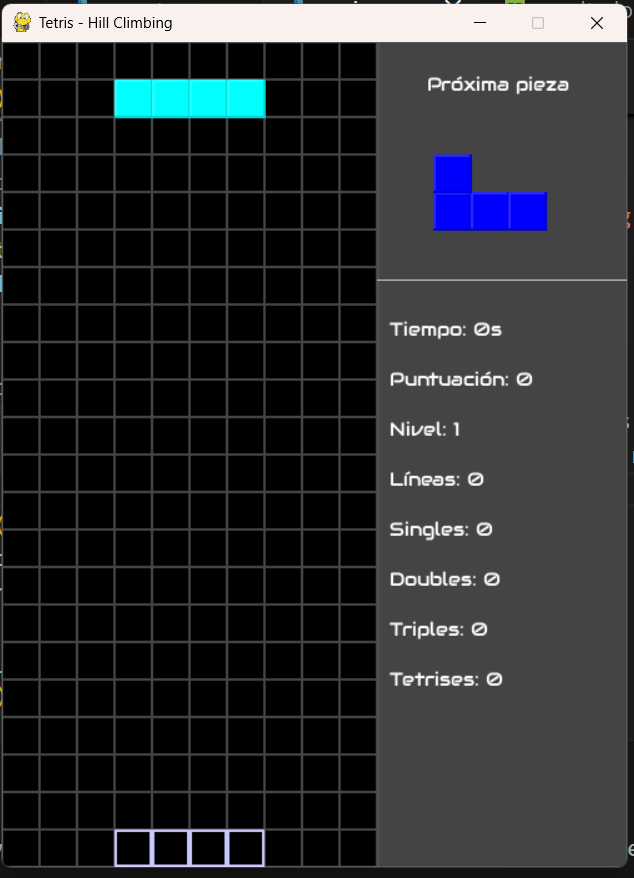
    

        Figura 1: Tablero del juego.
    

---

### 3.4 Generación y comportamiento de las piezas

Las piezas se generan utilizando el sistema 7-Bag, en el que cada conjunto contiene exactamente una copia de cada tetrominó y se reordena de manera aleatoria cada vez que la bolsa se vacía. Todas las piezas aparecen en orientación North Facing y ubicadas de forma centrada respecto del tablero, respetando las reglas del Tetris clásico.

Durante el turno de una pieza activa, esta puede:

 * Moverse horizontalmente una celda por acción,

* Rotarse en incrementos de 90°,

Además, se implementó la pieza fantasma (ghost piece), que indica la posición final de caída si la pieza se soltara en ese momento. Esta funcionalidad resulta útil para visualizar el entorno y para asistir a los algoritmos de toma de decisiones.

---

### 3.5 Niveles, objetivos y puntuación

El juego inicia siempre en el nivel 1. Para avanzar de nivel se utiliza un sistema de objetivo fijo, donde el jugador debe eliminar 10 líneas por nivel hasta alcanzar el nivel 15 (totalizando 150 líneas). El nivel afecta únicamente la velocidad de caída de las piezas.

La puntuación del tablero se actualiza según la cantidad de líneas eliminadas simultáneamente:

1 línea (Single): 100 puntos

2 líneas (Double): 200 puntos

3 líneas (Triple): 400 puntos

4 líneas (Tetris): 800 puntos

En caso de que se eliminen más de 4 lineas se toma el numero de líneas eliminadas separadas en bloques de a 4, por ejemplo, si el algoritmo elimina 7 lineas horizontales al colocar un pieza entonces estaria generando un tetris más un triple, obteniendo un total de 1200 ptos.

---

### 3.6 Condición de finalización

La partida finaliza cuando una pieza queda fijada en la parte superior del tablero, es decir, cuando se produce un top out.

    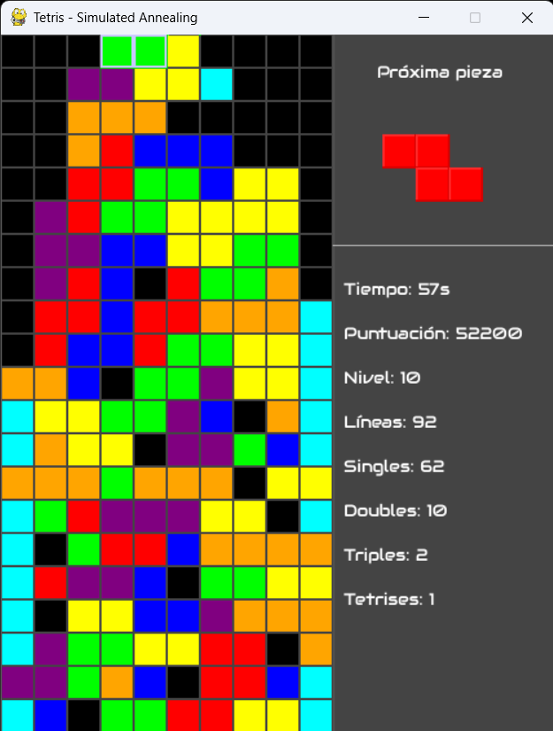
    

        Figura 2: Finalización de juego por top out.
    

---

### 3.7 Representación del estado y las piezas

El estado del juego se modela como la combinación del tablero actual y la pieza activa. Cada movimiento válido se genera aplicando todas las rotaciones posibles de la pieza y luego deslizándola horizontalmente hasta posiciones legales.

Las piezas se modelan como listas de coordenadas que representan las celdas ocupadas por cada figura. Cada rotación se define mediante una lista de coordenadas distinta, equivalente a aplicar una transformación de rotación sobre la figura original.

---

### 3.8 Función de evaluación

La función heurística utilizada por los agentes evalúa cada estado posible del tablero según cuatro características clave: la cantidad de líneas eliminadas, la generación de huecos, el desnivel entre columnas y la altura promedio de la estructura. Cada característica se pondera mediante un peso, cuyo valor determina la relevancia relativa que tendrá dentro del cálculo de la calidad del estado.

La selección de estos pesos responde a criterios estratégicos del juego, a pruebas empíricas y, en el caso del Algoritmo Genético, al hecho de que dicho agente evoluciona sus decisiones a lo largo del tiempo. Para establecer valores iniciales coherentes, partimos de una base de pesos, propuesto por Pierre Dellacherie en “The (Near) Perfect Tetris Bot”, del cual derivan la mayoría de los agentes clásicos de Tetris. Estos valores fueron luego ajustados para adaptarse a nuestra representación del tablero y a las necesidades específicas de cada algoritmo de búsqueda.

A continuación, se detallan las razones de la eleccion de cada peso:

### 3.8.1 Líneas eliminadas

*Objetivo*: premiar las jugadas que producen limpieza del tablero.

En Hill Climbing y Simulated Annealing se asignó un peso alto (3.5) porque eliminar líneas es la principal forma de puntuar y evitar que el tablero colapse.

    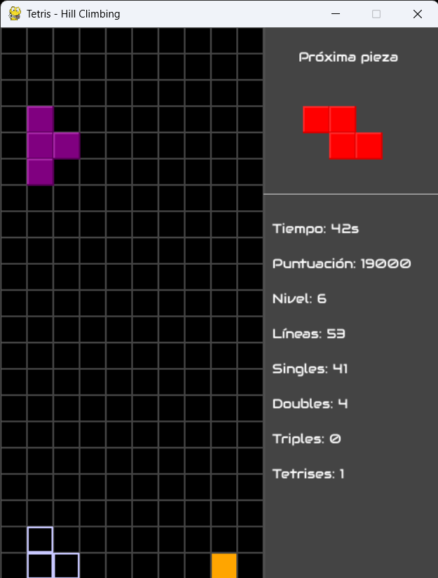
    

        Figura 3: Añgoritmo Hill Climbing.
    

En el Algoritmo Genético se redujo a 0.8 porque el GA explora combinaciones de piezas y, si la recompensa por líneas es demasiado grande, el algoritmo converge rápido a soluciones sesgadas que sólo priorizan limpiezas inmediatas y no construyen jugadas estables a largo plazo. La presión selectiva debe ser menor para permitir diversidad de estrategias.

    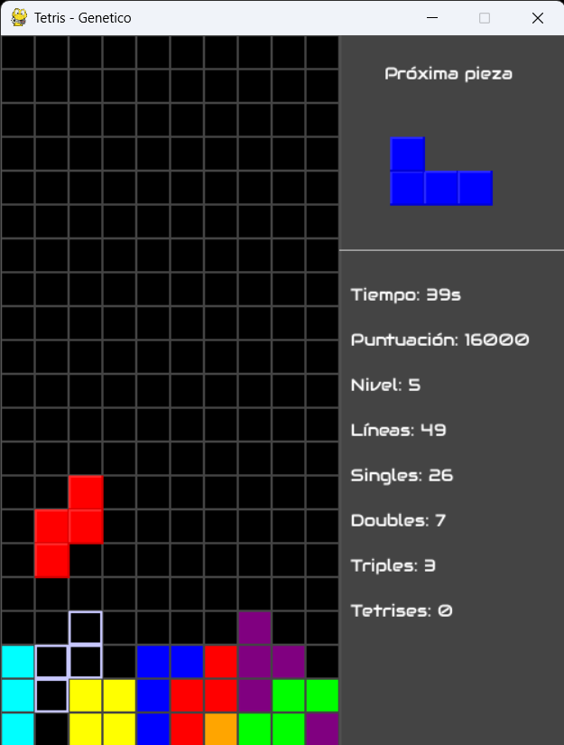
    

        Figura 4: Algoritmo Genético.
    

### 3.8.2 Huecos

*Objetivo*: penalizar la creación de huecos, ya que dificultan limpiezas futuras y suelen causar derrota.

Los huecos son la característica negativa más costosa en Tetris; siempre deben penalizarse con fuerza.

En Hill climbing y simulated annealing se usa un peso muy alto (5) para evitar movimientos que creen huecos casi de manera absoluta.

    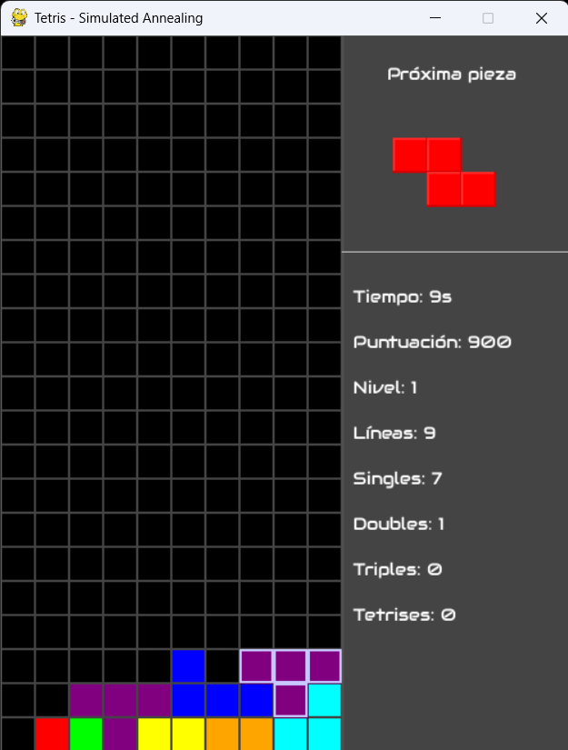
    

        Figura 5: Algoritmo Simulated Annealing minimizando huecos en partida.
    

En GA se usa un valor medio-alto (3.5) para permitir que en generaciones tempranas el algoritmo explore configuraciones que podrían ser útiles aunque tengan huecos, evitando que la población se estanque. Sin embargo, sigue siendo alto para evitar la finalizacion del juego al aceptar muchas pocisiones que generen huecos.

    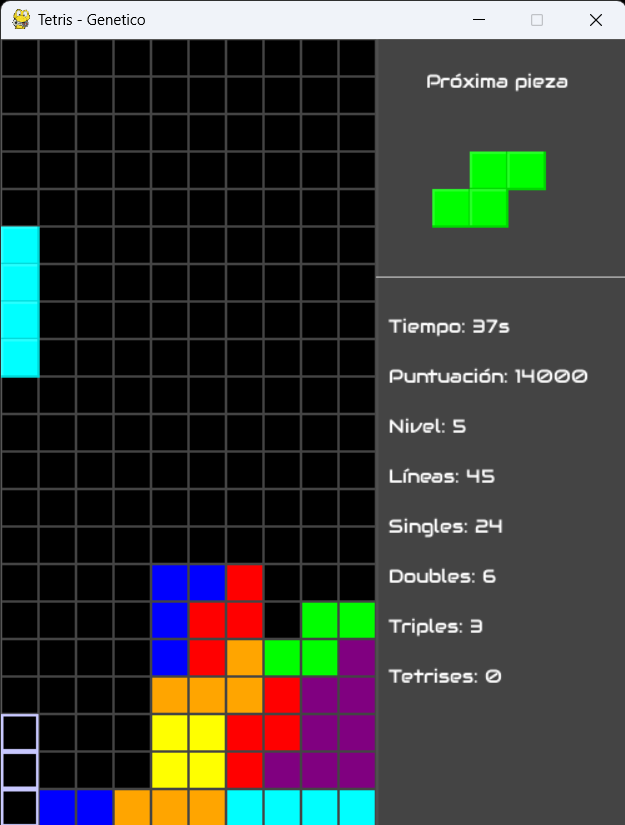
    

        Figura 6: Algoritmo genético.
    

### 3.8.3 Desnivel

*Objetivo*: evitar que el tablero tenga picos o valles pronunciados.

En ambas versiones se mantuvo un peso moderado (0.5).

La razón es que el desnivel es importante, pero no tan decisivo como los huecos o la limpieza. Un desnivel alto suele impedir colocar futuras piezas pero a nivel estrategico permite resevar posiciones para piezas que encajan perfectamente y permiten eliminar mayor cantidad de lineas.Por eso se penaliza, pero no con extrema agresividad.

    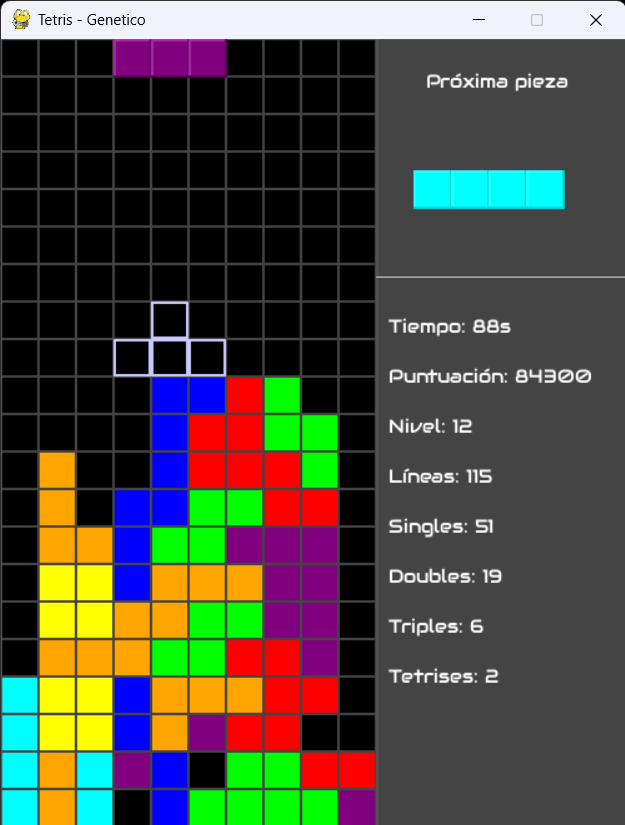
    

    	Figura 7: Desnivel en partida de algortimo genético.
    

### 3.8.4 Altura promedio

*Objetivo*: evitar que la estructura crezca hacia arriba, dejando espacio para maniobrar.

En HC/SA se utiliza un peso más alto (2) para castigar posiciones que elevan la torre rápidamente.

En GA el peso se reduce a 0.3, nuevamente para permitir mayor exploración en generaciones tempranas y evitar que la altura excesiva elimine estrategias potencialmente útiles antes de evolucionar.

La altura elevada aumenta el riesgo de perder, pero el GA necesita flexibilidad al inicio y no debe castigar demasiado este factor.

---

### 3.9 Especificaciones de implementacion de cada algoritmo

A continuacion se especifican los detalles de implementacion de cada algortimo.

### 3.9.1 Hill Climbing

El agente Hill Climbing genera todos los vecinos posibles de la pieza actual explorando cada combinación válida de columna y rotación. Para cada vecino simula la caída de la pieza, actualiza el estado y evalúa el resultado mediante la heurística definida. Luego selecciona el vecino con mayor valor heurístico; en caso de empate, elige aleatoriamente entre los mejores. Esta decisión se aplica al juego real y el proceso se repite pieza por pieza.

### 3.9.2 Simulated Annealing

Para cada pieza, el algoritmo genera previamente todas las combinaciones válidas de posiciones y rotaciones posibles. Cada combinación incluye la posición final en el tablero, la rotación alcanzada y el puntaje calculado por la función heurística. Este conjunto constituye el espacio de búsqueda sobre el cual opera el algoritmo.

El proceso comienza seleccionando de forma aleatoria uno de estos estados válidos como estado inicial. Esta aleatoriedad evita sesgos en la elección inicial y contribuye a una mayor diversidad en el comportamiento del agente entre distintas ejecuciones.

Un punto central del método es la temperatura inicial. En esta implementación, la temperatura se calcula mediante una fórmula que garantiza que un movimiento que empeora la heurística en 4 unidades tenga aproximadamente un 60% de probabilidad de ser aceptado. Esto da como resultado una temperatura inicial cercana a 7.575, lo que permite un grado significativo de exploración en las primeras etapas del algoritmo.

En cada iteración, el SA no considera todos los vecinos, sino que selecciona una muestra pequeña y aleatoria de ellos. Concretamente, se toman hasta 3 vecinos aleatorios del conjunto total.

 Entre estos vecinos seleccionados, el algoritmo elige el que tiene el mejor valor heurístico y lo considera como candidato a nuevo estado. Esta estrategia equilibra el costo computacional con la capacidad exploratoria, ya que reduce el número de evaluaciones por iteración sin perder diversidad.

Para decidir si el estado candidato se acepta o no, se aplica la regla de Metropolis. Si el estado candidato tiene un valor heurístico mayor que el actual, se acepta siempre. Si en cambio es peor, se acepta con una probabilidad que depende tanto de la magnitud del empeoramiento como de la temperatura actual. Específicamente, la probabilidad de aceptación se calcula como 
𝑒
Δ
/
𝑇

donde

Δ: diferencia de heurística entre el nuevo estado y el actual

𝑇: temperatura en ese momento. 

Esto significa que, especialmente al inicio cuando la temperatura es alta, el algoritmo tiene más libertad para explorar movimientos subóptimos.

La temperatura se actualiza en cada iteración mediante un esquema de enfriamiento exponencial, utilizando un coeficiente de 0.95. Esto implica que la temperatura disminuye gradualmente, reduciendo la probabilidad de aceptar movimientos peores a medida que avanza el proceso. El algoritmo continúa iterando hasta que la temperatura cae por debajo de 0.1 o hasta alcanzar un máximo de 300 iteraciones, lo que ocurra primero. Estos límites garantizan que el tiempo de cálculo sea acotado y que el algoritmo converja a una solución estable.

Finalmente, cuando el proceso concluye, el algoritmo devuelve la posición y rotación que resultaron seleccionadas tras todo el proceso de exploración y aceptación probabilística. Esa configuración se utiliza entonces para colocar la pieza en el tablero.

### 3.9.3 Genetic Algorithm

Para el agente basado en Algoritmo Genético (GA), cada individuo de la población representa una combinación posible de movimiento para la pieza actual del juego Tetris, definida como una tupla (posición, rotación, fitness). A partir del conjunto completo de combinaciones válidas, el algoritmo inicializa una población de tamaño 20 (o menor en caso de que existan menos combinaciones disponibles en ese turno).

### **Inicializacion**

* Se generan todas las combinaciones posibles válidas (pos, rot, fit) para la pieza actual.

* Se seleccionan 20 individuos iniciales de manera aleatoria para formar la población.

* Se define un tamaño de élite equivalente al 10% de la población (elite_size = 2).

### **Seleccion: Método de Torneo**

En cada iteración, la población se divide aleatoriamente en grupos de tamaño:

2 individuos si la población es par

3 individuos si es impar

En cada grupo se selecciona el individuo con mayor fitness. En caso de empate, se utiliza como criterio secundario el individuo cuyo valor y (posicion) sea el más bajo en el tablero, y si persiste el empate, la selección se resuelve de manera aleatoria.
Este proceso genera el conjunto de individuos más aptos que participarán del cruce.

### **Cruce**

Se aplica un cruzamiento completo pareado entre todos los individuos seleccionados:
cada individuo se cruza con todos los demás salvo consigo mismo.

El mecanismo de cruce intercambia atributos de la siguiente forma:

Con probabilidad menor a 0.5:

* La rotación del hijo proviene del padre 1

* La posición del hijo proviene del padre 2

De lo contrario:

* La rotación proviene del padre 2

* La posición proviene del padre 1

Una vez generada la tupla (pos, rot), se busca su fitness correspondiente en el conjunto de combinaciones válidas. Si el hijo no corresponde a un estado permitido, se reemplaza por uno de los padres para evitar pérdida de diversidad.

### **Mutación**

Tras el cruce, cada individuo tiene una probabilidad de 0.5 de sufrir una mutación en su rotación.

El proceso consiste en:

1. Seleccionar una rotación aleatoria entre las posibles para la pieza actual.

2. Buscar si (pos, rot_mutada) es una combinación válida.

3. Si existen múltiples combinaciones válidas con esa rotación, se elige una al azar para mantener diversidad.

Los individuos mutados se añaden a la población.

### **Elitismo y generación de la nueva población**

Luego del cruce y la mutación:

1. Se seleccionan los 2 mejores individuos de la población actual (élite).

2. Se combinan con la descendencia generada, que es ordenada por fitness y truncada para mantener el mismo tamaño poblacional.

3. La nueva población queda formada por elite + descendencia.

___

## 4. **Análisis y discusión de resultados**

### Singles, doubles, triples y tetrises (gráfico1)

Además de reportar los promedios de líneas eliminadas para cada tipo de eliminación (Singles, Doubles, Triples y Tetrises), se incluyó la desviación estándar correspondiente a cada métrica.
La desviación estándar permite evaluar la estabilidad del rendimiento de cada algoritmo: valores bajos indican comportamientos consistentes entre partidas, mientras que valores altos reflejan una mayor variabilidad. Para calcularla, se tomaron las 15 repeticiones realizadas por cada algoritmo sobre una secuencia de 400 piezas y se computó la desviación estándar por tipo de eliminación agrupando los resultados por algoritmo.

Finalmente, en la figura correspondiente se incorporaron barras de error sobre cada barra, representando gráficamente estas desviaciones. Esto permite una comparación más rigurosa entre algoritmos, ya que no solo se observa la media sino también la dispersión de los resultados.

    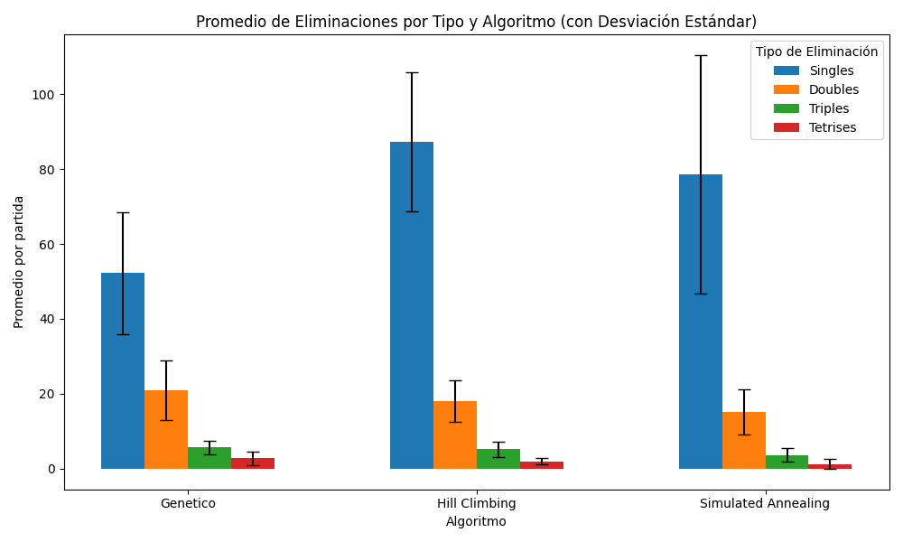
    

        Figura 8: Diagrama de barras con promedio de lineas eliminadas para cada tipo de eliminación.
    

En la figura 8 puede observarse que Hill Climbing es el algoritmo que más singles completa en promedio. Esto es consistente con su naturaleza determinista y fuertemente explotativa: en cada decisión selecciona la opción que maximiza la ganancia inmediata, lo cual conduce a una estrategia que elimina líneas con mayor frecuencia pero de forma individual, sin priorizar la acumulación necesaria para eliminaciones múltiples.

En contraste, el algoritmo Genético presenta mayores valores en doubles, triples y tetrises. Esto se alinea con su comportamiento explorativo: al trabajar con una población de soluciones y operadores estocásticos como mutación y cruce, el agente tiende a permitir configuraciones más diversas y con mayor altura, lo que favorece la generación de eliminaciones múltiples cuando se estabiliza la estructura.

Por otro lado, Simulated Annealing muestra la mayor variabilidad, especialmente en el caso de singles. Esto es esperable debido a su mecanismo probabilístico y a la influencia directa de la curva de enfriamiento: en etapas con temperaturas más altas puede aceptar peores movimientos, lo que provoca diferencias significativas entre partidas. Esta misma característica afecta también a doubles, triples y tetrises, ya que su comportamiento oscila entre fases explorativas y explotativas. En consecuencia, algunas ejecuciones logran secuencias de colocación más eficientes, mientras que otras se ven afectadas por decisiones subóptimas aceptadas en etapas tempranas.

***

### Nivel alcanzado vs puntaje obtenido

Para poder evaluar la eficiencia en la toma de decisiones y el desempeño de cada algoritmo hemos construido un gráfico de dispersión con barras de error.
En la figura 9 se representan los resultados obtenidos tras ejecutar cada algoritmo en un total de 15 partidas de 400 piezas cada una:

El eje Y (vertical) muestra el Puntaje Obtenido (promedio), indicando la calidad de la solución encontrada (mejor desempeño).

El eje X (horizontal) muestra el Nivel Alcanzado (promedio), que es una métrica de la habilidad del agente para sobrevivir y planificar a largo plazo.

Además, se incorporaron barras de error (desviaciones estándar) en ambos ejes. Estas barras nos permiten visualizar la variabilidad o consistencia de cada algoritmo, ofreciendo un panorama más amplio de los resultados obtenidos.

    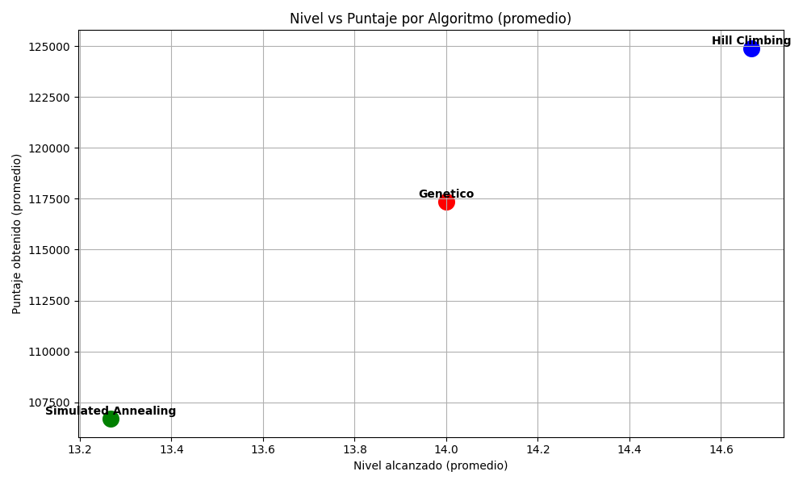
    

        Figura 9: Gráfico de dispersion de nivel alcanzado vs puntaje obtenido.
    

En la figura 9 se puede observar como el algortimo Hill Climbing (punto azul) presenta un desempeño superior, destacándose en tres aspectos clave:

* Mayor Puntaje y Nivel Alcanzado: logra el promedio de puntaje más alto (aproximadamente 128.000) y el promedio de nivel más alto (aproximadamente 15.5).

* Menor Variabilidad: Sus barras de error son notablemente más cortas en comparación con los otros dos algoritmos, lo que indica una mayor consistencia en sus resultados a lo largo de las 15 partidas.

Este resultado se corresponde con la naturaleza greedy del Hill Climbing, que prioriza la explotación inmediata de la mejor opción local. Al analizar y ver la toma decisiones del algoritmo durante cada jugada se podria decir que estos resultados se corresponden con el hecho de que al limpiar más lineas, al algoritmo logra con efectividad mantener el tablero despejado por lo que la probabilidad de que una partida termine por tablero completo es muy baja ya que siempre busca eliminar la mayor cantidad de lineas lo que le permite sobrevivir y, por ende, acumular mayor puntaje y alcanzar niveles más altos de forma sostenida.

Por su parte, los algoritmos genetico (punto rojo) y simulated annealing (punto verde) al ser más explorativos que el anterior pueden presentar mayor variablidad en los resultados. Esta mayor variabilidad es un efecto directo de su naturaleza explorativa. A diferencia del Hill Climbing, estos algoritmos están diseñados para evitar quedar atrapados en óptimos locales, lo que conlleva a dos situaciones:

1. Exploración Exitosa: En algunas partidas, que se ven favorecidas por orden en el que se generan las piezas, la exploración les permite encontrar configuraciones de tablero o estrategias que conducen a un buen desempeño.

2. Exploración Fallida: En otros casos, la inclinación hacia la exploración de estados no óptimos o la aceptación de movimientos "peores" (especialmente al inicio de la partida en el Simulated Annealing) puede llevarlos prematuramente a una configuración de tablero en la cual es dificil limpiar lineas. Esto resulta en partidas que terminan rápidamente por tablero completo y con puntajes muy bajos, lo que además aumenta drásticamente la desviación estándar general.

---

### Puntaje total por algoritmo

Para complementar el análisis anterior, se construyó un diagrama de caja que permite visualizar la distribución completa de los puntajes obtenidos por cada algoritmo implementado en un total de 15 partidas de 400 piezas jugadas. Este tipo de gráfico nos permite entender la dispersión, tendencia central, y la presencia de valores atípicos en los resultados.

Al analizar este gráfico, podremos evaluar no solo el rendimiento medio (mediana) de cada algoritmo, sino también su consistencia (qué tan estrecha es la caja) y su rango de resultados (la longitud total de los bigotes).

    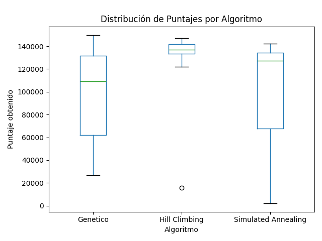
    

        Figura 10: Diagrama de caja con puntaje total.
    

En la figura 10 se puede observar como el algoritmo Hill climbing es el mas consistente respaldando los resultados anteriores, más especificamente:

* Su caja es la más estrecha y está ubicada en el nivel de puntajes más alto (la mediana se encuentra cerca de $\text{138.000}$).
* El 50% central de sus partidas se concentra en un rango muy pequeño, lo que prueba su alta consistencia.
* El rango pequeño de sus bigotes, junto con la estrechez de la caja, confirma que su estrategia greedy de explotación constante le permite mantener un alto rendimiento.

Por su parte el Simulated annealing, es el segundo mejor en cuanto a la tendencia central de sus resultados, pero presenta la mayor dispersión:

* La línea de su mediana se ubica aproximadamente en $\text{128.000}$, siendo superior a la mediana del Algoritmo Genético. Esto sugiere que, en el caso promedio (percentil 50), el SA logró un mejor puntaje que el GA.
* El tener una mediana alta combinada con gran dispersión indica que el SA logra altos puntajes cuando su exploración es exitosa, pero su riesgo de terminar una partida rápido por puntaje muy bajo es mucho mayor que en el GA.

Para  finalizar, el algortimo genético se encuentra en tercer lugar en términos de tendencia central:

* Su mediana se ubica cerca de $\text{110.000}$, siendo la más baja de los tres. Esto significa que el 50% central de sus resultados es consistentemente menor que el de los otros dos algoritmos.
* Aunque es menos consistente que el HC, su rango de resultados es más acotado que el del SA. Sus resultados mínimos son significativamente mejores que los mínimos del SA, por lo que demuestra tener una base de rendimiento más segura que el Simulated Annealing, a pesar de que su mediana más baja.
* Al observar el bigote superior, se evidencia que el Algoritmo Genético es capaz de alcanzar puntajes máximos comparables a los obtenidos por el Hill Climbing y el Simulated Annealing (superiores a $\text{140.000}$).

Este alto potencial sugiere que, en ciertas instancias, la estrategia evolutiva del algoritmo logra identificar combinaciones de pesos o jugadas que resultan en la limpieza masiva de líneas. Es probable que la ejecución exitosa de Tetrises y Triples, las jugadas que otorgan mayor puntaje, sea lo que impulsa estos resultados máximos, indicando que la exploración del GA es capaz de encontrar estrategias óptimas en su mejor caso.

---

### Puntaje obtenido vs Tiempo de toma de decisión

Para evaluar la eficiencia operativa de los tres algoritmos, construimos un gráfico de dispersión con barras de error (gráfico 4) que relaciona el puntaje obtenido (calidad de la decisión) con el tiempo promedio invertido en cada toma de decisión (velocidad de la decisión), el cual nos permite analizar qué algoritmo logra el mejor compromiso entre velocidad y desempeño.

La gráfica representa los resultados de un total de 15 partidas de 400 piezas jugadas por cada algoritmo, donde:

El Eje Y (Puntaje Obtenido - promedio) mide la calidad de la solución (el desempeño general del agente).

El Eje X (Tiempo Promedio de Decisión en segundos) mide la velocidad con la que el algoritmo selecciona el siguiente movimiento.

Las barras de error (desviaciones estándar) en ambos ejes nos permiten analizar la consistencia del algoritmo tanto en el desempeño del puntaje como en la estabilidad de su velocidad de procesamiento.

    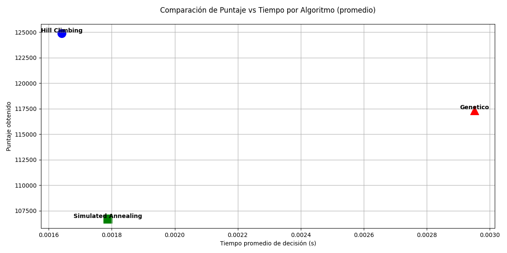
    

        Figura 11: Gráfico de dispersión de puntaje vs tiempo de decisión.
    

En el figura 11 podemos observar que el HC (azul) es el algoritmo que consigue el mejor resultado en la recion tiempo de decision - puntaje obtenido y esto es esperable ya que si bien analiza todos los vecinos y escoge el que devuelve mejores resultados, no realiza cálculos probabilísticos o poblacionales, lo que resulta en una baja complejidad computacional por paso. 

Por otro lado, tanto el Simulated Annealing (SA) como el algoritmo Genético (GA) incurren en un mayor tiempo de decisión debido a la naturaleza de sus procesos exploratorios, lo que los penaliza en el eje del tiempo de decision:

1. Simulated Annealing (verde):
*  Aunque tiene una estructura de búsqueda similar al HC, el SA añade el cálculo probabilístico (la función de aceptación dependiente de la 'temperatura') y la generación de números aleatorios en cada paso. Esta pequeña sobrecarga se traduce en un tiempo de decisión más largo.

2. Genetic (rojo):

* Presenta la mayor latencia, con un tiempo de decisión promedio de casi el doble que el HC y su puntaje promedio es comparable al del SA.

El tiempo de decisión elevado es resultado directo de su alta complejidad algorítmica. En cada paso, el GA debe:

1. Evaluar a múltiples individuos (la población).

2. Ejecutar procesos de selección y cruce (crossover).

3. Aplicar mutación a los individuos.

---

### Consistencia por algortimo

Para poder tener una estadistica pura de la variabilidad de cada algortimo con respecto al puntaje vs lineas eliminadas, presentamos un gráfico de dispersión que utiliza el Coeficiente de Variación (CV) en ambos ejes.

- Interpretacion de los ejes:

Eje X (CV Puntaje - %): Mide la variabilidad en los puntajes obtenidos.
* Un CV de Puntaje bajo indica que las diferencias entre el puntaje más alto y el más bajo de las partidas es pequeña en relación con el puntaje promedio.

Eje Y (CV Líneas Eliminadas - %): Mide la variabilidad en la cantidad de líneas eliminadas en las partidas.
* Un CV de Líneas bajo indica que el número de líneas que el algoritmo logra eliminar es muy similar en cada partida.

Tomamos la relacion entre el puntaje obtenido en cada partida y la cantidad de lineas eliminadas porque esto nos permite entender como se manifiestan las estrategias de exploración y explotacion en la estabilidad de los resultados 

* Un algoritmo que prioriza la explotación de la mejor solución inmediata tenderá a repetir patrones de juego exitosos, lo que se traduce en baja variabilidad en el puntaje y en las líneas eliminadas (punto cercano al origen).

* Un algoritmo que prioriza la exploración tomará riesgos en algunas partidas que fallarán, pero tendrá éxito en otras. Esto resulta en una alta variabilidad en ambas métricas (punto lejano al origen).

    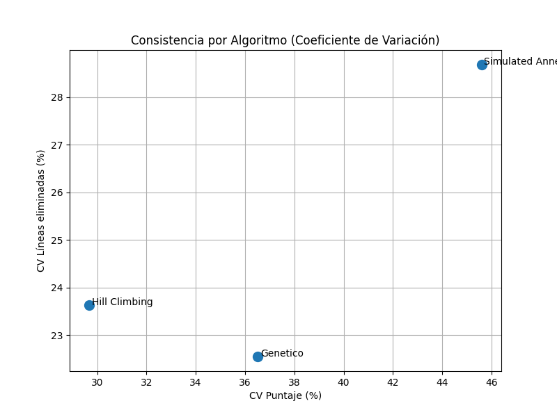
    

        Figura 12: Consistencia.
    

  
Hill climbing: Se ubica más cerca del origen, confirmando su naturaleza de Explotación. Su búsqueda greedy constante produce resultados muy estables tanto en la cantidad de líneas que limpia como en el puntaje final.

Genetic: Muestra una variabilidad moderada en ambos ejes. Su CV en líneas eliminadas es relativamente bajo, pero su CV de puntaje es alto, lo que sugiere que su estrategia de juego (líneas eliminadas) es más estable que su resultado final (puntaje).

Simulated annealing: Se ubica en el punto más alejado del origen, lo que confirma su alta tendencia a la Exploración. Esta variabilidad es el precio de su búsqueda global: en ocasiones encuentra soluciones óptimas, pero en muchas otras termina la partida rápidamente con resultados erráticos.

___

## 5. Conclusion

Basándonos en las métricas definidas, concluimos que el algoritmo Hill Climbing demuestra ser el agente de IA superior para la tarea de jugar al Tetris, esto no solo se refleja en el desempeño bruto, sino también en su eficiencia y estabilidad, los cuales son aspectos críticos para cualquier agente de toma de decisiones en tiempo real. Su prioridad en la explotación le permitió maximizar las jugadas de limpieza de líneas (singles y doubles) por encima de tetrises y triples, manteniendo el tablero despejado y asegurando la supervivencia a largo plazo, lo que a su vez le permitió conseguir mejor puntaje promedio entre los tres algoritmos. Además, demostró ser el agente más confiable y predecible, minimizando el riesgo de fallos graves que se observaron en los algoritmos exploratorios. 

Si bien los algoritmos exploratorios (GA y SA) pueden ejecutar jugadas de alto valor (Tetrises y triples), su constante búsqueda de soluciones globales comprometió el espacio del tablero, llevando a un mayor número de partidas terminadas por top out prematuramente. Por lo que la estrategia de Explotación local y consistente del Hill Climbing se alinea de manera más efectiva con el objetivo central del juego Tetris: supervivencia a largo plazo y limpieza eficiente del tablero, demostrando mejor relación entre rendimiento, velocidad y estabilidad.

Finalmente, dejamos planteadas dos modificaciones que se podrían implementar a futuro con el fin de mejorar el rendimiento, eficiencia y toma de decisiones de los agentes, y que no se desarrollaron en el presente proyecto:

### 1. Implementacion de lookahead:

Una limitación del diseño actual es que los agentes toman decisiones basándose únicamente en la pieza actual y el estado inmediato del tablero, por lo que se podría introducir un mecanismo de búsqueda anticipada (Lookahead) que permita a los algoritmos evaluar las consecuencias de sus movimientos considerando la siguiente pieza. Lo que podria reducir la variabilidad de los algoritmos exploratorios (Genético y Simulated Annealing), ya que una mejor planificación podría disminuir la probabilidad de fallos tempranos por acumulación de piezas.

### 2. Optimizacion de pesos en la funcion heurística

Actualmente, los pesos utilizados en la función heurística se han ajustado de manera empírica, por lo que el rendimiento del agente está limitado por la calidad de estos valores. Podriamos usar el Algoritmo Genético, que es un algoritmo de optimizacion, para ajustar automáticamente los pesos de la función heurística. El mismo se ejecutaría antes de jugar las partidas para evolucionar una población de vectores de pesos. La función de fitness de cada vector de pesos sería el puntaje promedio obtenido por el agente de Tetris que lo utiliza y esto nos debería permitir encontrar un conjunto de pesos que maximice el desempeño del agente, superando los límites que ya tenemos y logrando resultados superiores a los puntos actuales del Hill Climbing.
___

## **Bibliografía y Referencias**

Talbi, E. --G. (2009). Metaheuristics: From design to implementation.
Wiley.

Dellacherie, P. (2003). The (Near) Perfect Tetris Bot.

Russell, S., & Norvig, P. (2010). \_Artificial intelligence: A modern
approach\_ (3rd ed.). Prentice Hall.
