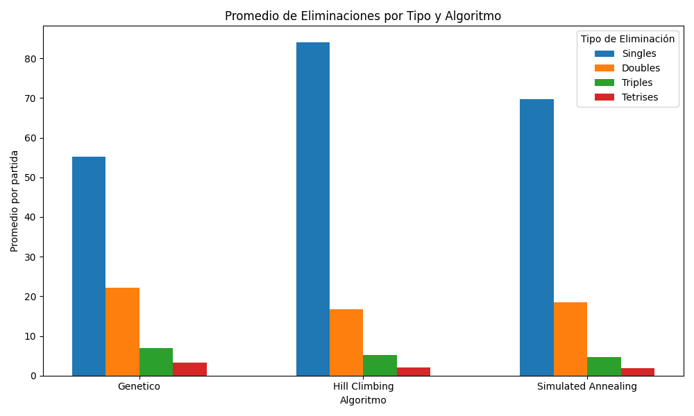

Algoritmos de Búsqueda local para jugar "Tetris"

Integrantes:

- Valerio, Perla

- Perea, Trinidad

**Introducción**

El presente proyecto tiene como finalidad aplicar y poner en práctica
los conceptos de algoritmos de búsqueda local estudiados en la materia,
mediante el desarrollo de un agente capaz de jugar de forma autónoma al
videojuego Tetris. Este juego, creado por Alekséi Pázhitnov en 1984, se
caracteriza por un tablero rectangular en el que piezas de diferentes
formas "tetrominos" descienden de manera continua, y el objetivo del
jugador es encajarlas de forma tal que se completen líneas horizontales,
las cuales se eliminan para obtener puntuación y evitar que el tablero
se llene.

El poroyecto consistió en implementar desde cero una versión funcional
de Tetris en el lenguaje de programación Python, que sirviera como
entorno de pruebas para el agente. Sobre esta base, se incorporaron tres
algoritmos de búsqueda local: **Hill Climbing**, **Simulated Annealing**
y **Algoritmo Genético**, adaptados para la toma de decisiones en cada
jugada. El agente evalúa posibles movimientos y selecciona la opción que
maximiza su función de evaluación, considerando factores como líneas
eliminadas, altura de la pila de piezas y huecos generados.

La elección de Tetris como caso de estudio se debe a que combina
elementos de aleatoriedad, planificación y optimización en tiempo real,
lo que lo convierte en un entorno ideal para experimentar con
estrategias de búsqueda local. Este informe presenta el proceso de
desarrollo, la metodología empleada, los resultados obtenidos y un
análisis comparativo del rendimiento de cada algoritmo.

{width="6.458333333333333in"
height="3.595138888888889in"}

**Descripción del juego**

Tetris es un videojuego de tipo puzzle en el que piezas compuestas por
bloques cuadrados denominadas tetrominos descienden desde la parte
superior de un tablero rectangular. El objetivo es mover y rotar estas
piezas para encajarlas de forma que se completen líneas horizontales
continuas. Cada vez que se completa una línea, esta se elimina y se
otorgan puntos al jugador.

El juego finaliza cuando las piezas apiladas alcanzan la parte superior
del tablero, impidiendo la aparición de nuevas piezas. Durante la
partida, las piezas se generan de manera aleatoria y descienden de forma
continua, aumentando la velocidad a medida que avanza el juego y va
subiendo de nivel, lo que va aumentando su dificultad.

Existen siete tipos de tetrominós, cada uno con una forma característica
identificada por una letra: I, O, T, L, J, S y Z. El jugador puede
desplazar las piezas hacia la izquierda o derecha, rotarlas y hacerlas
descender más rápidamente, con el fin de colocarlas en la posición
óptima para maximizar la puntuación y evitar huecos innecesarios en la
estructura de bloques.

{width="6.1375in" height="0.6944444444444444in"}

En esta implementación, se adoptó un sistema de puntuación clásico que
otorga diferentes cantidades de puntos según el número de líneas
eliminadas de forma simultánea: una línea (singles), dos (doubles), tres
(triples) o cuatro (tetrises).

**Juego Autónomo y su implementación**

Para este proyecto, el Tetris fue adaptado para ser jugado por un agente
autónomo. Este agente toma decisiones en tiempo real sobre cómo colocar
cada pieza, evaluando todas las posiciones y rotaciones posibles antes
de que la pieza llegue al fondo del tablero.

El núcleo del proceso de decisión se basa en una función heurística, que
asigna una puntuación a cada configuración del tablero teniendo en
cuenta factores clave:

- Líneas eliminadas: favorece jugadas que limpien la mayor cantidad
  posible.

- Huecos generados: intenta no dejar espacios vacíos bajo otras piezas.

- Altura máxima: evita acumular piezas demasiado alto, reduciendo el
  riesgo de perder.

- Desnivel entre columnas: prefiere superficies más planas para
  facilitar colocaciones futuras.

A partir de esta evaluación, el agente selecciona la jugada más
prometedora usando algoritmos de búsqueda local.

Los algoritmos que se implementaron en el proyecto son:

- Hill Climbing

- Simulated Annealing

- Algoritmo Genético

**Marco Teorico**

**Hill Climbing**

La manera en la que este algoritmo funciona es explorando todas las
posiciones y rotaciones válidas para la pieza actual, y elige aquella
que ofrezca la mejor posición según la heurística implementada. Se trata
de un algoritmo rápido y sencillo pero que a su vez puede quedarse
atrapado en soluciones que de manera "local" parecen buenas, pero que
afecten muy probablemente a futuro en el avance del juego.

Su funcionamiento a través del agente es el siguiente:

- Dada la pieza actual, se evalúan todos los posibles movimientos,
  generando todas las posiciones y rotaciones validas

- Se evalúan las posibles soluciones de ubicación mediante la función
  heurística

- Se selecciona el mejor posible movimiento

- Se aplica el movimiento seleccionado

- Al no tener en cuenta movimientos peores que el actual, es muy
  probable que no se llegue a la mejor solución a largo plazo en el
  transcurso del juego Tetris

**Simulated Annealing**

El algoritmo Simulated Annealing se inspira en el proceso físico de
enfriamiento de metales, en el que la temperatura de un material se
reduce gradualmente para que alcance una configuración estable de mínima
energía. En el contexto del Tetris autónomo, esta técnica se utiliza
para evitar que el agente se quede atrapado en soluciones "localmente
óptimas" y pueda explorar jugadas que, a corto plazo, parecen peores
pero que podrían conducir a mejores resultados a largo plazo.

Su funcionamiento a través del agente es el siguiente:

- Se genera el conjunto de jugadas posibles, es decir, todas las
  posiciones y rotaciones validas evaluadas por la función heurística

- Se selecciona el estado inicial

- En cada jugada se elige un estado nuevo y se calcula el delta entre la
  puntuación de la nueva jugada y la actual

- El enfriamiento se maneja de manera gradual, con el sentido de que al
  inicio haya una alta probabilidad de aceptar jugadas peores. A manera
  que avanza el juego la temperatura disminuye, multiplicándose por el
  factor de enfriamiento, reduciendo la probabilidad de aceptar malas
  jugadas.

- Se detiene cuando la temperatura queda por debajo del umbral mínimo, o
  cuando alcanza la cantidad máxima de iteraciones.

Mediante todo ese procedimiento es cómo funciona el algoritmo Simulated
Annealing (SA), logrando un equilibrio en el juego del Tetris en este
caso, haciéndolo menos predecible que simplemente eligiendo el mejor
movimiento inmediato.

**Algoritmo Genético**

El Algoritmo Genético es una técnica inspirada en la evolución
biológica, que busca soluciones de calidad mediante la selección,
recombinación y mutación de posibles jugadas. En el Tetris, cada posible
movimiento de la pieza se considera como un "individuo" en una
población.

Su funcionamiento a través del agente es:

- Se crean varios individuos representando una combinación valida de
  posición y rotación de la pieza actual, la cual es evaluada con la
  función heurística

- Se seleccionan los más aptos, se elige el de mayor puntuación de cada
  grupo para formar la siguiente generación

- Mediante mutación se modifican algunos atributos de los individuos

- Se repite la selección, mutación y cruce durante una cantidad de
  iteraciones, o hasta que no detecten mejoras.

- El individuo con la mejor puntuación es el elegido para la pieza
  actual

Gracias a este enfoque, el algoritmo genético permite explorar de forma
amplia el espacio de posibles jugadas y combinar características
exitosas de soluciones previas, lo que puede producir decisiones más
estratégicas que las de algoritmos puramente deterministas.

**Cuadro Comparativo entre algoritmos de búsqueda local aplicados**

  ------------------------------------------------------------------------
  parámetro          Hill Climbing     Simulated         Algoritmo
									   Annealing         Genético
  ------------------ ----------------- ----------------- -----------------
  **Tipo de          Búsqueda local    Búsqueda local    Búsqueda
  búsqueda**         determinística:   probabilística:   poblacional
					 Siempre elige la  permite aceptar   inspirada en la
					 mejor opción      soluciones peores evolución
					 inmediata         al inicio,        biológica:
									   simulando el      trabaja con una
									   enfriamiento de   población de
									   metales           soluciones que
														 evolucionan

  **Capacidad de     Baja: se queda    Alta: puede       Alta: la
  escapar de óptimos atrapado si no    aceptar           diversidad
  locales**          hay vecinos       soluciones peores genética permite
					 mejores           parda escapar de  explorar
									   óptimos locales   múltiples
														 regiones del
														 espacio de
														 búsqueda

  **Exploración vs   Explotación       Equilibrio        Alta exploración:
  explotación**      fuerte: enfocado  controlado por la combina cruce y
					 solo en mejorar   temperatura: más  mutación para
									   exploración al    generar variedad
									   principio, mas    
									   explotación al    
									   final             

  **Uso de           Mínimo: solo si   Moderado: usa     Alto: a
  aleatoriedad**     se elige          aleatoriedad para selección, cruce
					 aleatoriamente    seleccionar       y mutación son
					 entre vecinos     vecinos y aceptar procesos
					 iguales           soluciones peores estocásticos

  **Dependencia de   Baja: solo        Media: necesita   Alta: muchos
  parámetros**       depende de la     definir           parámetros
					 función           temperatura       influyen (tamaño
					 heurística        inicial, tasa de  de población,
									   enfriamiento,     tasas de
									   criterio de       mutación/cruce,
									   parada.           elitismo, etc.)

  **Costo            Bajo: rápido,     Medio: mas        Alta: evalúa
  computacional**    simple, apto para costoso por       múltiples
					 decisiones en     evaluar múltiples soluciones por
					 tiempo real       vecinos y usar    generación y
									   funciones         realiza
									   probabilísticas   operaciones
														 genéticas

  **Aplicabilidad en Alta: ideal para  Media: puede      Baja-Media:
  tiempo real**      entornos con      adaptarse, pero   requiere
					 decisiones        necesita buena    optimización o
					 rápidas como      juste de          simplificación
					 Tetris            parámetros para   para usarse en
									   que sea ágil      tiempo real.

  **Complejidad de   Baja: se          Media: requiere   Alta: implica
  implementación**   implementa        lógica de         manejar
					 fácilmente con    temperatura,      estructuras de
					 pocos pasos       aceptación        población,
									   probabilística y  operadores
									   enfriamiento      genéticos y
														 ciclos evolutivos
  ------------------------------------------------------------------------

**Objetivos del Juego**

El objetivo principal del Tetris, tanto en la versión tradicional, como
en la implementada en este proyecto, es maximizar la puntuación e ir
avanzando de nivel, evitando que el tablero se llene.

Por lo tanto el agente debe colocar las piezas de forma estratégica, con
el fin de completar líneas horizontales que se eliminan de manera
automática.

El objetivo se desenglosa con el siguiente puntaje:

- Singles: 1 líneas eliminada tiene el valor de 100 puntos

- Doubles: 2 líneas eliminadas de manera simultánea tiene el valor de
  200 puntos

- Triples: 3 líneas eliminadas de manera simultánea tiene el valor de
  400 puntos

- Tetrises: 4 líneas eliminadas de manera simultánea tiene el valor de
  800 puntos

Por lo tanto, se busca priorizar la mayor cantidad de líneas juntas para
eliminar de manera simultánea, y así sumar la mayor cantidad de puntos.
A su vez mantener un tablero estable, es decir evitar dejar huecos o
espacios difíciles de rellenar, también minimizar la altura alcanzada
para reducir el riesgo de perder.

A medida que se va avanzando en el juego, es decir, se va subiendo de
nivel, el tiempo de caída de las piezas va aumentando, lo que va
dificultando a la hora de tomar decisiones.

**Diseño Experimental**

Para llevar a cabo el análisis comparativo de los tres algoritmos
implementados, se utilizó una semilla aleatoria que garantiza la
generación de la misma secuencia de piezas para los tres algoritmos.
Esta decisión se tomó debido a que, en pruebas preliminares sin control
de secuencia, los resultados obtenidos eran inconsistentes, lo que
impedía extraer conclusiones válidas. Al utilizar la semilla, se asegura
que cada algoritmo reciba las mismas piezas en el mismo orden,
permitiendo una comparación justa y precisa de su desempeño.

El análisis consistió en implementar un total de 400 piezas, repitiendo
este procedimiento 15 veces para cada algoritmo. Esta metodología
permitió obtener un conjunto de resultados suficientemente amplio y
representativo, sobre el cual se pudieron realizar análisis estadísticos
y extraer conclusiones confiables acerca del comportamiento de cada
algoritmo.

Para evaluar el rendimiento y las decisiones de los algoritmos, se
seleccionaron las siguientes **métricas**:

- Cantidad de singles, dobles, triples y tetrises: Permite analizar la
  eficiencia en la eliminación de líneas y la capacidad de formar
  combinaciones óptimas.

- Nivel alcanzado por algoritmo: Indica la progresión del juego y la
  habilidad del algoritmo para sostenerse en niveles más avanzados.

- Puntaje obtenido: Refleja el desempeño global del algoritmo en función
  de las reglas de puntuación del juego.

- Tiempo promedio de toma de decisión: Evalúa la eficiencia
  computacional y la rapidez con la que el algoritmo selecciona la mejor
  acción posible.

- Consistencia por algoritmo: Mide la estabilidad del rendimiento entre
  distintas ejecuciones del mismo algoritmo bajo la misma secuencia de
  piezas.

- Cantidad de líneas eliminadas por piezas colocadas: Proporciona un
  indicador de eficiencia en la colocación de piezas y en la
  optimización del espacio de juego.

Estas métricas permiten un análisis integral, considerando tanto el
desempeño cuantitativo (puntaje, líneas eliminadas) como cualitativo
(eficiencia de decisiones y consistencia), proporcionando una visión
completa sobre las fortalezas y debilidades de cada algoritmo.

**Análisis individual de cada Grafico**

[Singles, Dobles, Triples y Tetrises]{.underline}

{width="4.381944444444445in"
height="2.629166666666667in"}Hill Climbing es el algoritmo más efectivo
en eliminar líneas constantemente, pero en su mayoría singles. El
algoritmo Genético apuesta a jugadas de mayor riesgo, con menos singles
pero más tetrises y triples puntuando muy alto en algunas partidas. Y
por último Simulated Annealing queda en el medio.

[Nivel alcanzado vs puntaje obtenido]{.underline}

Este grafico relacione el nivel alcanzado con el puntaje promedio. Se
observa que Hill Climbing es el que mejor desempeño global obtiene, el
genético logra un rendimiento aceptable, y Simulated Annealing queda con
el peor resultado.

{width="4.506774934383202in"
height="2.7041666666666666in"}

[Puntaje total por algoritmo]{.underline}

Gráfico de cajas que muestra la distribución de los puntajes obtenidos
por los tres algoritmos. Hill Climbing resulta ser el más estable y
confiable con resultados altos y consistentes, mientras que el Genético
y el Simulated Annealing muestran mayor dispersión, si bien alcanzan
puntajes elevados, la variabilidad es alta y los resultados no son
predecibles.

{width="3.9375in" height="2.9533475503062117in"}

[Puntaje obtenido vs Tiempo de toma de decisión]{.underline}

Gráfico de comparación entre el puntaje promedio y el tiempo promedio de
decisión para cada algoritmo. Hill Climbing es el más rápido con mejores
resultados, luego le sigue el Genético que consume más tiempo y no
obtiene los mejores resultados, y luego está el Simulated Annealing que
es el que peor rinde, ni con buenos resultados ni puntajes.

{width="6.1375in" height="3.06875in"}

[Consistencia por algoritmo]{.underline}

El siguiente grafico representa la consistencia de los algoritmos medida
a través del coeficiente de variación tanto para el puntaje como para
las líneas eliminadas. Mientras menor coeficiente de variación haya,
mayor consistencia habrá, es decir, los resultados de los algoritmos son
más estables entre ejecuciones. Se puede observar que el algoritmo Hill
Climbing es el más consistente en puntaje, esto nos dice que aunque no
siempre obtenga el mejor rendimiento absoluto, sus resultados tienden a
ser más previsibles. El algoritmo Genético muestra mejor consistencia en
líneas eliminadas pero es más variable en cuanto al puntaje. Por último
el algoritmo Simulated Annealing es el menos consistente de los tres con
mucha variabilidad entre ejecuciones.

{width="4.046893044619423in"
height="3.035398075240595in"}

[Cantidad de líneas eliminadas por piezas colocadas]{.underline}

Lo que nos devuelve esta grafica es que el algoritmo Hill Climbing logra
un uso más eficiente de cada pieza, sacando más provecho al juego, el
algoritmo genético también se comporta bien pero un poco menos, y en
cuanto al Simulated Annealing no optimiza tan bien la colocación de
piezas en el entorno Tetris.

{width="3.5388888888888888in"
height="2.6543667979002623in"}

**Conclusión**

[Matriz de métricas como conclusión]{.underline}

{width="8.094209317585301in" height="2.3125in"}Se
realizó una matriz de métricas para evaluar y poder comparar todos los
resultados, no solo a nivel de puntaje sino también en eficiencia y
calidad de juego.

Dada esta matriz de resultados, se puede llegar a la conclusión, en
términos globales, de que el algoritmo Hill Climbing fie el más eficaz y
consistente para resolver Tetris, alcanzando el mayor puntaje, más
líneas eliminadas, menor altura y huecos en el tablero. El algoritmo
Genético ofreció un rendimiento intermedio, destacándose en la obtención
de tetrises, aunque con mayor variabilidad en los resultados. Por
último, Simulated Annealing presento el desempeño más bajo en casi todas
las métricas mostrando poca consistencia y eficiencia en comparación a
los otros algoritmos.

**Bibliografía y Referencias**

Talbi, E. --G. (2009). Metaheuristics: From design to implementation.
Wiley.

Russell, S., & Norvig, P. (2010). \_Artificial intelligence: A modern
approach\_ (3rd ed.). Prentice Hall.
